# SCRAPING DATA BMKG DAN JOBSTREET

## Author
[Tasya Anisah Rizqi](https://github.com/tasyaanisahrizqi/) (G1501231046)

## Program R Data Scraping
[RPubs Data Scraping BMKG & Jobstreet](https://rpubs.com/tasyaanisahrizqi/scraping-data)

## Menu
[Data Scraping BMKG](#books-data-scraping-bmkg)
•
[Data Scraping Jobstreet](#books-data-scraping-jobstreet)
•
[Visualisasi Data Scraping BMKG](#books-visualisasi-data-scraping-bmkg)
•
[Visualisasi Data Scraping Jobstreet](#books-visualisasi-data-scraping-jobstreet)

## :books: Data Scraping BMKG
    kable(data_bmkg, format = "markdown")

<table>
<colgroup>
<col style="width: 10%" />
<col style="width: 14%" />
<col style="width: 13%" />
<col style="width: 13%" />
<col style="width: 13%" />
<col style="width: 13%" />
<col style="width: 7%" />
<col style="width: 10%" />
</colgroup>
<thead>
<tr class="header">
<th style="text-align: left;">Tanggal</th>
<th style="text-align: left;">Kota</th>
<th style="text-align: left;">Pagi</th>
<th style="text-align: left;">Siang</th>
<th style="text-align: left;">Malam</th>
<th style="text-align: left;">Dini_Hari</th>
<th style="text-align: left;">Suhu</th>
<th style="text-align: left;">Kelembapan</th>
</tr>
</thead>
<tbody>
<tr class="odd">
<td style="text-align: left;">2024-06-15</td>
<td style="text-align: left;">Banda Aceh</td>
<td style="text-align: left;">Cerah</td>
<td style="text-align: left;">Cerah</td>
<td style="text-align: left;">Cerah</td>
<td style="text-align: left;">Berawan Tebal</td>
<td style="text-align: left;">24 - 34</td>
<td style="text-align: left;">60 - 85</td>
</tr>
<tr class="even">
<td style="text-align: left;">2024-06-15</td>
<td style="text-align: left;">Denpasar</td>
<td style="text-align: left;">Cerah Berawan</td>
<td style="text-align: left;">Cerah Berawan</td>
<td style="text-align: left;">Cerah Berawan</td>
<td style="text-align: left;">Cerah Berawan</td>
<td style="text-align: left;">24 - 33</td>
<td style="text-align: left;">70 - 90</td>
</tr>
<tr class="odd">
<td style="text-align: left;">2024-06-15</td>
<td style="text-align: left;">Serang</td>
<td style="text-align: left;">Cerah Berawan</td>
<td style="text-align: left;">Hujan Ringan</td>
<td style="text-align: left;">Hujan Sedang</td>
<td style="text-align: left;">Hujan Ringan</td>
<td style="text-align: left;">24 - 34</td>
<td style="text-align: left;">60 - 95</td>
</tr>
<tr class="even">
<td style="text-align: left;">2024-06-15</td>
<td style="text-align: left;">Bengkulu</td>
<td style="text-align: left;">Berawan</td>
<td style="text-align: left;">Hujan Ringan</td>
<td style="text-align: left;">Hujan Petir</td>
<td style="text-align: left;">Hujan Petir</td>
<td style="text-align: left;">22 - 32</td>
<td style="text-align: left;">75 - 100</td>
</tr>
<tr class="odd">
<td style="text-align: left;">2024-06-15</td>
<td style="text-align: left;">Yogyakarta</td>
<td style="text-align: left;">Cerah Berawan</td>
<td style="text-align: left;">Hujan Ringan</td>
<td style="text-align: left;">Berawan</td>
<td style="text-align: left;">Berawan</td>
<td style="text-align: left;">25 - 32</td>
<td style="text-align: left;">65 - 95</td>
</tr>
<tr class="even">
<td style="text-align: left;">2024-06-15</td>
<td style="text-align: left;">Jakarta Pusat</td>
<td style="text-align: left;">Berawan</td>
<td style="text-align: left;">Cerah Berawan</td>
<td style="text-align: left;">Hujan Ringan</td>
<td style="text-align: left;">Berawan Tebal</td>
<td style="text-align: left;">24 - 30</td>
<td style="text-align: left;">70 - 95</td>
</tr>
<tr class="odd">
<td style="text-align: left;">2024-06-15</td>
<td style="text-align: left;">Gorontalo</td>
<td style="text-align: left;">Hujan Ringan</td>
<td style="text-align: left;">Berawan</td>
<td style="text-align: left;">Berawan</td>
<td style="text-align: left;">Cerah Berawan</td>
<td style="text-align: left;">23 - 33</td>
<td style="text-align: left;">65 - 95</td>
</tr>
<tr class="even">
<td style="text-align: left;">2024-06-15</td>
<td style="text-align: left;">Jambi</td>
<td style="text-align: left;">Kabut</td>
<td style="text-align: left;">Hujan Petir</td>
<td style="text-align: left;">Berawan</td>
<td style="text-align: left;">Kabut</td>
<td style="text-align: left;">23 - 33</td>
<td style="text-align: left;">60 - 100</td>
</tr>
<tr class="odd">
<td style="text-align: left;">2024-06-15</td>
<td style="text-align: left;">Bandung</td>
<td style="text-align: left;">Cerah Berawan</td>
<td style="text-align: left;">Hujan Petir</td>
<td style="text-align: left;">Hujan Sedang</td>
<td style="text-align: left;">Berawan</td>
<td style="text-align: left;">20 - 27</td>
<td style="text-align: left;">55 - 95</td>
</tr>
<tr class="even">
<td style="text-align: left;">2024-06-15</td>
<td style="text-align: left;">Semarang</td>
<td style="text-align: left;">Berawan</td>
<td style="text-align: left;">Berawan</td>
<td style="text-align: left;">Hujan Ringan</td>
<td style="text-align: left;">Berawan</td>
<td style="text-align: left;">24 - 33</td>
<td style="text-align: left;">60 - 90</td>
</tr>
<tr class="odd">
<td style="text-align: left;">2024-06-15</td>
<td style="text-align: left;">Surabaya</td>
<td style="text-align: left;">Berawan</td>
<td style="text-align: left;">Cerah Berawan</td>
<td style="text-align: left;">Cerah Berawan</td>
<td style="text-align: left;">Berawan</td>
<td style="text-align: left;">26 - 33</td>
<td style="text-align: left;">55 - 90</td>
</tr>
<tr class="even">
<td style="text-align: left;">2024-06-15</td>
<td style="text-align: left;">Pontianak</td>
<td style="text-align: left;">Cerah Berawan</td>
<td style="text-align: left;">Hujan Sedang</td>
<td style="text-align: left;">Cerah Berawan</td>
<td style="text-align: left;">Cerah Berawan</td>
<td style="text-align: left;">24 - 34</td>
<td style="text-align: left;">65 - 100</td>
</tr>
<tr class="odd">
<td style="text-align: left;">2024-06-15</td>
<td style="text-align: left;">Banjarmasin</td>
<td style="text-align: left;">Cerah Berawan</td>
<td style="text-align: left;">Hujan Petir</td>
<td style="text-align: left;">Berawan</td>
<td style="text-align: left;">Cerah Berawan</td>
<td style="text-align: left;">24 - 33</td>
<td style="text-align: left;">60 - 95</td>
</tr>
<tr class="even">
<td style="text-align: left;">2024-06-15</td>
<td style="text-align: left;">Palangkaraya</td>
<td style="text-align: left;">Berawan</td>
<td style="text-align: left;">Berawan</td>
<td style="text-align: left;">Berawan</td>
<td style="text-align: left;">Berawan</td>
<td style="text-align: left;">24 - 32</td>
<td style="text-align: left;">65 - 95</td>
</tr>
<tr class="odd">
<td style="text-align: left;">2024-06-15</td>
<td style="text-align: left;">Samarinda</td>
<td style="text-align: left;">Berawan</td>
<td style="text-align: left;">Cerah Berawan</td>
<td style="text-align: left;">Berawan</td>
<td style="text-align: left;">Berawan Tebal</td>
<td style="text-align: left;">24 - 28</td>
<td style="text-align: left;">85 - 100</td>
</tr>
<tr class="even">
<td style="text-align: left;">2024-06-15</td>
<td style="text-align: left;">Tarakan</td>
<td style="text-align: left;">Cerah Berawan</td>
<td style="text-align: left;">Cerah Berawan</td>
<td style="text-align: left;">Hujan Ringan</td>
<td style="text-align: left;">Hujan Ringan</td>
<td style="text-align: left;">24 - 32</td>
<td style="text-align: left;">70 - 95</td>
</tr>
<tr class="odd">
<td style="text-align: left;">2024-06-15</td>
<td style="text-align: left;">Pangkal Pinang</td>
<td style="text-align: left;">Berawan</td>
<td style="text-align: left;">Cerah Berawan</td>
<td style="text-align: left;">Berawan</td>
<td style="text-align: left;">Hujan Ringan</td>
<td style="text-align: left;">24 - 33</td>
<td style="text-align: left;">65 - 100</td>
</tr>
<tr class="even">
<td style="text-align: left;">2024-06-15</td>
<td style="text-align: left;">Tanjung Pinang</td>
<td style="text-align: left;">Berawan</td>
<td style="text-align: left;">Hujan Petir</td>
<td style="text-align: left;">Berawan</td>
<td style="text-align: left;">Berawan</td>
<td style="text-align: left;">25 - 31</td>
<td style="text-align: left;">70 - 95</td>
</tr>
<tr class="odd">
<td style="text-align: left;">2024-06-15</td>
<td style="text-align: left;">Bandar Lampung</td>
<td style="text-align: left;">Cerah Berawan</td>
<td style="text-align: left;">Cerah Berawan</td>
<td style="text-align: left;">Hujan Ringan</td>
<td style="text-align: left;">Cerah Berawan</td>
<td style="text-align: left;">23 - 32</td>
<td style="text-align: left;">55 - 100</td>
</tr>
<tr class="even">
<td style="text-align: left;">2024-06-15</td>
<td style="text-align: left;">Ambon</td>
<td style="text-align: left;">Hujan Ringan</td>
<td style="text-align: left;">Hujan Ringan</td>
<td style="text-align: left;">Hujan Sedang</td>
<td style="text-align: left;">Hujan Ringan</td>
<td style="text-align: left;">24 - 30</td>
<td style="text-align: left;">80 - 95</td>
</tr>
<tr class="odd">
<td style="text-align: left;">2024-06-15</td>
<td style="text-align: left;">Ternate</td>
<td style="text-align: left;">Berawan</td>
<td style="text-align: left;">Hujan Ringan</td>
<td style="text-align: left;">Cerah Berawan</td>
<td style="text-align: left;">Cerah Berawan</td>
<td style="text-align: left;">23 - 31</td>
<td style="text-align: left;">70 - 100</td>
</tr>
<tr class="even">
<td style="text-align: left;">2024-06-15</td>
<td style="text-align: left;">Mataram</td>
<td style="text-align: left;">Cerah Berawan</td>
<td style="text-align: left;">Cerah Berawan</td>
<td style="text-align: left;">Cerah Berawan</td>
<td style="text-align: left;">Cerah Berawan</td>
<td style="text-align: left;">22 - 31</td>
<td style="text-align: left;">60 - 95</td>
</tr>
<tr class="odd">
<td style="text-align: left;">2024-06-15</td>
<td style="text-align: left;">Kupang</td>
<td style="text-align: left;">Cerah Berawan</td>
<td style="text-align: left;">Cerah Berawan</td>
<td style="text-align: left;">Cerah Berawan</td>
<td style="text-align: left;">Cerah Berawan</td>
<td style="text-align: left;">23 - 33</td>
<td style="text-align: left;">50 - 90</td>
</tr>
<tr class="even">
<td style="text-align: left;">2024-06-15</td>
<td style="text-align: left;">Kota Jayapura</td>
<td style="text-align: left;">Berawan</td>
<td style="text-align: left;">Hujan Ringan</td>
<td style="text-align: left;">Hujan Ringan</td>
<td style="text-align: left;">Berawan Tebal</td>
<td style="text-align: left;">23 - 31</td>
<td style="text-align: left;">65 - 95</td>
</tr>
<tr class="odd">
<td style="text-align: left;">2024-06-15</td>
<td style="text-align: left;">Manokwari</td>
<td style="text-align: left;">Berawan</td>
<td style="text-align: left;">Hujan Ringan</td>
<td style="text-align: left;">Hujan Ringan</td>
<td style="text-align: left;">Berawan</td>
<td style="text-align: left;">24 - 31</td>
<td style="text-align: left;">65 - 95</td>
</tr>
<tr class="even">
<td style="text-align: left;">2024-06-15</td>
<td style="text-align: left;">Pekanbaru</td>
<td style="text-align: left;">Kabut</td>
<td style="text-align: left;">Berawan</td>
<td style="text-align: left;">Hujan Ringan</td>
<td style="text-align: left;">Hujan Ringan</td>
<td style="text-align: left;">24 - 30</td>
<td style="text-align: left;">80 - 100</td>
</tr>
<tr class="odd">
<td style="text-align: left;">2024-06-15</td>
<td style="text-align: left;">Mamuju</td>
<td style="text-align: left;">Cerah Berawan</td>
<td style="text-align: left;">Berawan</td>
<td style="text-align: left;">Berawan</td>
<td style="text-align: left;">Hujan Ringan</td>
<td style="text-align: left;">25 - 32</td>
<td style="text-align: left;">70 - 95</td>
</tr>
<tr class="even">
<td style="text-align: left;">2024-06-15</td>
<td style="text-align: left;">Makassar</td>
<td style="text-align: left;">Cerah Berawan</td>
<td style="text-align: left;">Cerah Berawan</td>
<td style="text-align: left;">Berawan</td>
<td style="text-align: left;">Berawan</td>
<td style="text-align: left;">24 - 32</td>
<td style="text-align: left;">75 - 90</td>
</tr>
<tr class="odd">
<td style="text-align: left;">2024-06-15</td>
<td style="text-align: left;">Kendari</td>
<td style="text-align: left;">Berawan</td>
<td style="text-align: left;">Hujan Ringan</td>
<td style="text-align: left;">Berawan</td>
<td style="text-align: left;">Cerah Berawan</td>
<td style="text-align: left;">24 - 32</td>
<td style="text-align: left;">70 - 95</td>
</tr>
<tr class="even">
<td style="text-align: left;">2024-06-15</td>
<td style="text-align: left;">Manado</td>
<td style="text-align: left;">Cerah Berawan</td>
<td style="text-align: left;">Hujan Ringan</td>
<td style="text-align: left;">Cerah Berawan</td>
<td style="text-align: left;">Cerah Berawan</td>
<td style="text-align: left;">23 - 31</td>
<td style="text-align: left;">70 - 95</td>
</tr>
<tr class="odd">
<td style="text-align: left;">2024-06-15</td>
<td style="text-align: left;">Padang</td>
<td style="text-align: left;">Cerah Berawan</td>
<td style="text-align: left;">Hujan Ringan</td>
<td style="text-align: left;">Berawan</td>
<td style="text-align: left;">Hujan Ringan</td>
<td style="text-align: left;">23 - 30</td>
<td style="text-align: left;">75 - 95</td>
</tr>
<tr class="even">
<td style="text-align: left;">2024-06-15</td>
<td style="text-align: left;">Palembang</td>
<td style="text-align: left;">Berawan</td>
<td style="text-align: left;">Berawan</td>
<td style="text-align: left;">Hujan Ringan</td>
<td style="text-align: left;">Berawan</td>
<td style="text-align: left;">24 - 33</td>
<td style="text-align: left;">55 - 95</td>
</tr>
<tr class="odd">
<td style="text-align: left;">2024-06-15</td>
<td style="text-align: left;">Medan</td>
<td style="text-align: left;">Cerah Berawan</td>
<td style="text-align: left;">Cerah Berawan</td>
<td style="text-align: left;">Hujan Lebat</td>
<td style="text-align: left;">Berawan</td>
<td style="text-align: left;">24 - 33</td>
<td style="text-align: left;">70 - 95</td>
</tr>
<tr class="even">
<td style="text-align: left;">2024-06-16</td>
<td style="text-align: left;">Banda Aceh</td>
<td style="text-align: left;">Cerah Berawan</td>
<td style="text-align: left;">Cerah</td>
<td style="text-align: left;">Cerah Berawan</td>
<td style="text-align: left;">Berawan</td>
<td style="text-align: left;">25 - 35</td>
<td style="text-align: left;">50 - 85</td>
</tr>
<tr class="odd">
<td style="text-align: left;">2024-06-16</td>
<td style="text-align: left;">Denpasar</td>
<td style="text-align: left;">Cerah Berawan</td>
<td style="text-align: left;">Berawan</td>
<td style="text-align: left;">Berawan</td>
<td style="text-align: left;">Cerah Berawan</td>
<td style="text-align: left;">24 - 31</td>
<td style="text-align: left;">65 - 90</td>
</tr>
<tr class="even">
<td style="text-align: left;">2024-06-16</td>
<td style="text-align: left;">Serang</td>
<td style="text-align: left;">Berawan Tebal</td>
<td style="text-align: left;">Hujan Ringan</td>
<td style="text-align: left;">Berawan</td>
<td style="text-align: left;">Hujan Ringan</td>
<td style="text-align: left;">22 - 32</td>
<td style="text-align: left;">65 - 95</td>
</tr>
<tr class="odd">
<td style="text-align: left;">2024-06-16</td>
<td style="text-align: left;">Bengkulu</td>
<td style="text-align: left;">Berawan</td>
<td style="text-align: left;">Hujan Ringan</td>
<td style="text-align: left;">Hujan Ringan</td>
<td style="text-align: left;">Hujan Sedang</td>
<td style="text-align: left;">24 - 32</td>
<td style="text-align: left;">75 - 95</td>
</tr>
<tr class="even">
<td style="text-align: left;">2024-06-16</td>
<td style="text-align: left;">Yogyakarta</td>
<td style="text-align: left;">Cerah Berawan</td>
<td style="text-align: left;">Cerah Berawan</td>
<td style="text-align: left;">Cerah Berawan</td>
<td style="text-align: left;">Berawan</td>
<td style="text-align: left;">25 - 33</td>
<td style="text-align: left;">60 - 95</td>
</tr>
<tr class="odd">
<td style="text-align: left;">2024-06-16</td>
<td style="text-align: left;">Jakarta Pusat</td>
<td style="text-align: left;">Berawan</td>
<td style="text-align: left;">Cerah Berawan</td>
<td style="text-align: left;">Berawan</td>
<td style="text-align: left;">Cerah Berawan</td>
<td style="text-align: left;">24 - 29</td>
<td style="text-align: left;">80 - 95</td>
</tr>
<tr class="even">
<td style="text-align: left;">2024-06-16</td>
<td style="text-align: left;">Gorontalo</td>
<td style="text-align: left;">Cerah Berawan</td>
<td style="text-align: left;">Hujan Lebat</td>
<td style="text-align: left;">Cerah Berawan</td>
<td style="text-align: left;">Berawan</td>
<td style="text-align: left;">23 - 33</td>
<td style="text-align: left;">65 - 95</td>
</tr>
<tr class="odd">
<td style="text-align: left;">2024-06-16</td>
<td style="text-align: left;">Jambi</td>
<td style="text-align: left;">Kabut</td>
<td style="text-align: left;">Hujan Ringan</td>
<td style="text-align: left;">Hujan Petir</td>
<td style="text-align: left;">Hujan Ringan</td>
<td style="text-align: left;">23 - 33</td>
<td style="text-align: left;">60 - 100</td>
</tr>
<tr class="even">
<td style="text-align: left;">2024-06-16</td>
<td style="text-align: left;">Bandung</td>
<td style="text-align: left;">Cerah</td>
<td style="text-align: left;">Cerah Berawan</td>
<td style="text-align: left;">Cerah Berawan</td>
<td style="text-align: left;">Cerah Berawan</td>
<td style="text-align: left;">19 - 26</td>
<td style="text-align: left;">60 - 95</td>
</tr>
<tr class="odd">
<td style="text-align: left;">2024-06-16</td>
<td style="text-align: left;">Semarang</td>
<td style="text-align: left;">Berawan</td>
<td style="text-align: left;">Berawan</td>
<td style="text-align: left;">Berawan</td>
<td style="text-align: left;">Berawan</td>
<td style="text-align: left;">24 - 33</td>
<td style="text-align: left;">60 - 90</td>
</tr>
<tr class="even">
<td style="text-align: left;">2024-06-16</td>
<td style="text-align: left;">Surabaya</td>
<td style="text-align: left;">Cerah Berawan</td>
<td style="text-align: left;">Cerah</td>
<td style="text-align: left;">Cerah</td>
<td style="text-align: left;">Hujan Sedang</td>
<td style="text-align: left;">25 - 33</td>
<td style="text-align: left;">65 - 90</td>
</tr>
<tr class="odd">
<td style="text-align: left;">2024-06-16</td>
<td style="text-align: left;">Pontianak</td>
<td style="text-align: left;">Berawan</td>
<td style="text-align: left;">Cerah Berawan</td>
<td style="text-align: left;">Berawan</td>
<td style="text-align: left;">Hujan Ringan</td>
<td style="text-align: left;">23 - 34</td>
<td style="text-align: left;">55 - 100</td>
</tr>
<tr class="even">
<td style="text-align: left;">2024-06-16</td>
<td style="text-align: left;">Banjarmasin</td>
<td style="text-align: left;">Berawan</td>
<td style="text-align: left;">Hujan Sedang</td>
<td style="text-align: left;">Berawan</td>
<td style="text-align: left;">Berawan</td>
<td style="text-align: left;">24 - 33</td>
<td style="text-align: left;">60 - 95</td>
</tr>
<tr class="odd">
<td style="text-align: left;">2024-06-16</td>
<td style="text-align: left;">Palangkaraya</td>
<td style="text-align: left;">Cerah Berawan</td>
<td style="text-align: left;">Berawan</td>
<td style="text-align: left;">Berawan</td>
<td style="text-align: left;">Berawan</td>
<td style="text-align: left;">24 - 34</td>
<td style="text-align: left;">55 - 95</td>
</tr>
<tr class="even">
<td style="text-align: left;">2024-06-16</td>
<td style="text-align: left;">Samarinda</td>
<td style="text-align: left;">Berawan Tebal</td>
<td style="text-align: left;">Berawan</td>
<td style="text-align: left;">Cerah Berawan</td>
<td style="text-align: left;">Hujan Ringan</td>
<td style="text-align: left;">24 - 31</td>
<td style="text-align: left;">70 - 100</td>
</tr>
<tr class="odd">
<td style="text-align: left;">2024-06-16</td>
<td style="text-align: left;">Tarakan</td>
<td style="text-align: left;">Cerah Berawan</td>
<td style="text-align: left;">Cerah Berawan</td>
<td style="text-align: left;">Cerah Berawan</td>
<td style="text-align: left;">Berawan</td>
<td style="text-align: left;">23 - 32</td>
<td style="text-align: left;">70 - 100</td>
</tr>
<tr class="even">
<td style="text-align: left;">2024-06-16</td>
<td style="text-align: left;">Pangkal Pinang</td>
<td style="text-align: left;">Cerah Berawan</td>
<td style="text-align: left;">Hujan Ringan</td>
<td style="text-align: left;">Hujan Ringan</td>
<td style="text-align: left;">Cerah Berawan</td>
<td style="text-align: left;">24 - 33</td>
<td style="text-align: left;">65 - 100</td>
</tr>
<tr class="odd">
<td style="text-align: left;">2024-06-16</td>
<td style="text-align: left;">Tanjung Pinang</td>
<td style="text-align: left;">Hujan Ringan</td>
<td style="text-align: left;">Hujan Ringan</td>
<td style="text-align: left;">Berawan</td>
<td style="text-align: left;">Hujan Ringan</td>
<td style="text-align: left;">24 - 31</td>
<td style="text-align: left;">70 - 95</td>
</tr>
<tr class="even">
<td style="text-align: left;">2024-06-16</td>
<td style="text-align: left;">Bandar Lampung</td>
<td style="text-align: left;">Hujan Ringan</td>
<td style="text-align: left;">Cerah</td>
<td style="text-align: left;">Cerah</td>
<td style="text-align: left;">Berawan</td>
<td style="text-align: left;">23 - 28</td>
<td style="text-align: left;">75 - 100</td>
</tr>
<tr class="odd">
<td style="text-align: left;">2024-06-16</td>
<td style="text-align: left;">Ambon</td>
<td style="text-align: left;">Hujan Ringan</td>
<td style="text-align: left;">Hujan Ringan</td>
<td style="text-align: left;">Berawan</td>
<td style="text-align: left;">Cerah Berawan</td>
<td style="text-align: left;">24 - 30</td>
<td style="text-align: left;">80 - 95</td>
</tr>
<tr class="even">
<td style="text-align: left;">2024-06-16</td>
<td style="text-align: left;">Ternate</td>
<td style="text-align: left;">Berawan</td>
<td style="text-align: left;">Berawan</td>
<td style="text-align: left;">Hujan Sedang</td>
<td style="text-align: left;">Berawan</td>
<td style="text-align: left;">25 - 31</td>
<td style="text-align: left;">70 - 90</td>
</tr>
<tr class="odd">
<td style="text-align: left;">2024-06-16</td>
<td style="text-align: left;">Mataram</td>
<td style="text-align: left;">Cerah</td>
<td style="text-align: left;">Cerah Berawan</td>
<td style="text-align: left;">Cerah Berawan</td>
<td style="text-align: left;">Cerah</td>
<td style="text-align: left;">22 - 32</td>
<td style="text-align: left;">60 - 95</td>
</tr>
<tr class="even">
<td style="text-align: left;">2024-06-16</td>
<td style="text-align: left;">Kupang</td>
<td style="text-align: left;">Cerah</td>
<td style="text-align: left;">Cerah</td>
<td style="text-align: left;">Cerah Berawan</td>
<td style="text-align: left;">Cerah Berawan</td>
<td style="text-align: left;">23 - 32</td>
<td style="text-align: left;">50 - 90</td>
</tr>
<tr class="odd">
<td style="text-align: left;">2024-06-16</td>
<td style="text-align: left;">Kota Jayapura</td>
<td style="text-align: left;">Berawan</td>
<td style="text-align: left;">Hujan Ringan</td>
<td style="text-align: left;">Berawan</td>
<td style="text-align: left;">Berawan</td>
<td style="text-align: left;">23 - 31</td>
<td style="text-align: left;">65 - 95</td>
</tr>
<tr class="even">
<td style="text-align: left;">2024-06-16</td>
<td style="text-align: left;">Manokwari</td>
<td style="text-align: left;">Berawan</td>
<td style="text-align: left;">Hujan Ringan</td>
<td style="text-align: left;">Berawan</td>
<td style="text-align: left;">Berawan</td>
<td style="text-align: left;">24 - 32</td>
<td style="text-align: left;">70 - 95</td>
</tr>
<tr class="odd">
<td style="text-align: left;">2024-06-16</td>
<td style="text-align: left;">Pekanbaru</td>
<td style="text-align: left;">Kabut</td>
<td style="text-align: left;">Hujan Ringan</td>
<td style="text-align: left;">Berawan Tebal</td>
<td style="text-align: left;">Kabut</td>
<td style="text-align: left;">24 - 29</td>
<td style="text-align: left;">80 - 100</td>
</tr>
<tr class="even">
<td style="text-align: left;">2024-06-16</td>
<td style="text-align: left;">Mamuju</td>
<td style="text-align: left;">Hujan Ringan</td>
<td style="text-align: left;">Berawan</td>
<td style="text-align: left;">Hujan Sedang</td>
<td style="text-align: left;">Hujan Lebat</td>
<td style="text-align: left;">26 - 30</td>
<td style="text-align: left;">70 - 85</td>
</tr>
<tr class="odd">
<td style="text-align: left;">2024-06-16</td>
<td style="text-align: left;">Makassar</td>
<td style="text-align: left;">Cerah Berawan</td>
<td style="text-align: left;">Hujan Ringan</td>
<td style="text-align: left;">Berawan</td>
<td style="text-align: left;">Berawan</td>
<td style="text-align: left;">24 - 33</td>
<td style="text-align: left;">65 - 90</td>
</tr>
<tr class="even">
<td style="text-align: left;">2024-06-16</td>
<td style="text-align: left;">Kendari</td>
<td style="text-align: left;">Berawan</td>
<td style="text-align: left;">Hujan Ringan</td>
<td style="text-align: left;">Berawan</td>
<td style="text-align: left;">Berawan</td>
<td style="text-align: left;">24 - 32</td>
<td style="text-align: left;">70 - 95</td>
</tr>
<tr class="odd">
<td style="text-align: left;">2024-06-16</td>
<td style="text-align: left;">Manado</td>
<td style="text-align: left;">Berawan</td>
<td style="text-align: left;">Hujan Lebat</td>
<td style="text-align: left;">Cerah Berawan</td>
<td style="text-align: left;">Berawan</td>
<td style="text-align: left;">23 - 31</td>
<td style="text-align: left;">65 - 95</td>
</tr>
<tr class="even">
<td style="text-align: left;">2024-06-16</td>
<td style="text-align: left;">Padang</td>
<td style="text-align: left;">Berawan</td>
<td style="text-align: left;">Hujan Petir</td>
<td style="text-align: left;">Hujan Petir</td>
<td style="text-align: left;">Berawan</td>
<td style="text-align: left;">24 - 26</td>
<td style="text-align: left;">90 - 100</td>
</tr>
<tr class="odd">
<td style="text-align: left;">2024-06-16</td>
<td style="text-align: left;">Palembang</td>
<td style="text-align: left;">Cerah Berawan</td>
<td style="text-align: left;">Berawan Tebal</td>
<td style="text-align: left;">Hujan Ringan</td>
<td style="text-align: left;">Hujan Ringan</td>
<td style="text-align: left;">23 - 33</td>
<td style="text-align: left;">60 - 100</td>
</tr>
<tr class="even">
<td style="text-align: left;">2024-06-16</td>
<td style="text-align: left;">Medan</td>
<td style="text-align: left;">Berawan</td>
<td style="text-align: left;">Cerah Berawan</td>
<td style="text-align: left;">Hujan Lebat</td>
<td style="text-align: left;">Berawan</td>
<td style="text-align: left;">24 - 29</td>
<td style="text-align: left;">80 - 95</td>
</tr>
<tr class="odd">
<td style="text-align: left;">2024-06-17</td>
<td style="text-align: left;">Banda Aceh</td>
<td style="text-align: left;">Berawan</td>
<td style="text-align: left;">Berawan</td>
<td style="text-align: left;">Berawan</td>
<td style="text-align: left;">Cerah Berawan</td>
<td style="text-align: left;">24 - 33</td>
<td style="text-align: left;">55 - 90</td>
</tr>
<tr class="even">
<td style="text-align: left;">2024-06-17</td>
<td style="text-align: left;">Denpasar</td>
<td style="text-align: left;">Cerah Berawan</td>
<td style="text-align: left;">Cerah Berawan</td>
<td style="text-align: left;">Cerah Berawan</td>
<td style="text-align: left;">Cerah Berawan</td>
<td style="text-align: left;">24 - 32</td>
<td style="text-align: left;">60 - 95</td>
</tr>
<tr class="odd">
<td style="text-align: left;">2024-06-17</td>
<td style="text-align: left;">Serang</td>
<td style="text-align: left;">Berawan</td>
<td style="text-align: left;">Hujan Ringan</td>
<td style="text-align: left;">Berawan</td>
<td style="text-align: left;">Berawan</td>
<td style="text-align: left;">23 - 33</td>
<td style="text-align: left;">60 - 95</td>
</tr>
<tr class="even">
<td style="text-align: left;">2024-06-17</td>
<td style="text-align: left;">Bengkulu</td>
<td style="text-align: left;">Berawan</td>
<td style="text-align: left;">Berawan</td>
<td style="text-align: left;">Hujan Ringan</td>
<td style="text-align: left;">Berawan</td>
<td style="text-align: left;">24 - 32</td>
<td style="text-align: left;">65 - 95</td>
</tr>
<tr class="odd">
<td style="text-align: left;">2024-06-17</td>
<td style="text-align: left;">Yogyakarta</td>
<td style="text-align: left;">Cerah Berawan</td>
<td style="text-align: left;">Cerah Berawan</td>
<td style="text-align: left;">Berawan</td>
<td style="text-align: left;">Berawan</td>
<td style="text-align: left;">25 - 33</td>
<td style="text-align: left;">60 - 95</td>
</tr>
<tr class="even">
<td style="text-align: left;">2024-06-17</td>
<td style="text-align: left;">Jakarta Pusat</td>
<td style="text-align: left;">Cerah Berawan</td>
<td style="text-align: left;">Cerah Berawan</td>
<td style="text-align: left;">Berawan</td>
<td style="text-align: left;">Cerah Berawan</td>
<td style="text-align: left;">25 - 32</td>
<td style="text-align: left;">75 - 95</td>
</tr>
<tr class="odd">
<td style="text-align: left;">2024-06-17</td>
<td style="text-align: left;">Gorontalo</td>
<td style="text-align: left;">Hujan Ringan</td>
<td style="text-align: left;">Berawan</td>
<td style="text-align: left;">Cerah Berawan</td>
<td style="text-align: left;">Cerah Berawan</td>
<td style="text-align: left;">23 - 33</td>
<td style="text-align: left;">65 - 95</td>
</tr>
<tr class="even">
<td style="text-align: left;">2024-06-17</td>
<td style="text-align: left;">Jambi</td>
<td style="text-align: left;">Kabut</td>
<td style="text-align: left;">Hujan Ringan</td>
<td style="text-align: left;">Berawan</td>
<td style="text-align: left;">Cerah Berawan</td>
<td style="text-align: left;">23 - 32</td>
<td style="text-align: left;">70 - 100</td>
</tr>
<tr class="odd">
<td style="text-align: left;">2024-06-17</td>
<td style="text-align: left;">Bandung</td>
<td style="text-align: left;">Cerah Berawan</td>
<td style="text-align: left;">Cerah Berawan</td>
<td style="text-align: left;">Cerah Berawan</td>
<td style="text-align: left;">Cerah Berawan</td>
<td style="text-align: left;">17 - 32</td>
<td style="text-align: left;">55 - 95</td>
</tr>
<tr class="even">
<td style="text-align: left;">2024-06-17</td>
<td style="text-align: left;">Semarang</td>
<td style="text-align: left;">Cerah Berawan</td>
<td style="text-align: left;">Berawan</td>
<td style="text-align: left;">Berawan</td>
<td style="text-align: left;">Berawan</td>
<td style="text-align: left;">26 - 33</td>
<td style="text-align: left;">60 - 85</td>
</tr>
<tr class="odd">
<td style="text-align: left;">2024-06-17</td>
<td style="text-align: left;">Surabaya</td>
<td style="text-align: left;">Cerah</td>
<td style="text-align: left;">Cerah Berawan</td>
<td style="text-align: left;">Cerah Berawan</td>
<td style="text-align: left;">Cerah</td>
<td style="text-align: left;">25 - 33</td>
<td style="text-align: left;">60 - 85</td>
</tr>
<tr class="even">
<td style="text-align: left;">2024-06-17</td>
<td style="text-align: left;">Pontianak</td>
<td style="text-align: left;">Hujan Ringan</td>
<td style="text-align: left;">Hujan Petir</td>
<td style="text-align: left;">Berawan</td>
<td style="text-align: left;">Berawan</td>
<td style="text-align: left;">24 - 33</td>
<td style="text-align: left;">60 - 95</td>
</tr>
<tr class="odd">
<td style="text-align: left;">2024-06-17</td>
<td style="text-align: left;">Banjarmasin</td>
<td style="text-align: left;">Cerah Berawan</td>
<td style="text-align: left;">Hujan Petir</td>
<td style="text-align: left;">Berawan</td>
<td style="text-align: left;">Hujan Ringan</td>
<td style="text-align: left;">24 - 33</td>
<td style="text-align: left;">60 - 95</td>
</tr>
<tr class="even">
<td style="text-align: left;">2024-06-17</td>
<td style="text-align: left;">Palangkaraya</td>
<td style="text-align: left;">Berawan</td>
<td style="text-align: left;">Berawan</td>
<td style="text-align: left;">Hujan Ringan</td>
<td style="text-align: left;">Berawan</td>
<td style="text-align: left;">24 - 32</td>
<td style="text-align: left;">60 - 95</td>
</tr>
<tr class="odd">
<td style="text-align: left;">2024-06-17</td>
<td style="text-align: left;">Samarinda</td>
<td style="text-align: left;">Berawan</td>
<td style="text-align: left;">Berawan</td>
<td style="text-align: left;">Cerah Berawan</td>
<td style="text-align: left;">Kabut</td>
<td style="text-align: left;">24 - 31</td>
<td style="text-align: left;">70 - 100</td>
</tr>
<tr class="even">
<td style="text-align: left;">2024-06-17</td>
<td style="text-align: left;">Tarakan</td>
<td style="text-align: left;">Cerah Berawan</td>
<td style="text-align: left;">Cerah Berawan</td>
<td style="text-align: left;">Cerah</td>
<td style="text-align: left;">Cerah Berawan</td>
<td style="text-align: left;">25 - 31</td>
<td style="text-align: left;">75 - 90</td>
</tr>
<tr class="odd">
<td style="text-align: left;">2024-06-17</td>
<td style="text-align: left;">Pangkal Pinang</td>
<td style="text-align: left;">Hujan Ringan</td>
<td style="text-align: left;">Hujan Ringan</td>
<td style="text-align: left;">Hujan Ringan</td>
<td style="text-align: left;">Hujan Petir</td>
<td style="text-align: left;">23 - 33</td>
<td style="text-align: left;">65 - 100</td>
</tr>
<tr class="even">
<td style="text-align: left;">2024-06-17</td>
<td style="text-align: left;">Tanjung Pinang</td>
<td style="text-align: left;">Hujan Ringan</td>
<td style="text-align: left;">Berawan</td>
<td style="text-align: left;">Berawan</td>
<td style="text-align: left;">Hujan Ringan</td>
<td style="text-align: left;">24 - 32</td>
<td style="text-align: left;">65 - 95</td>
</tr>
<tr class="odd">
<td style="text-align: left;">2024-06-17</td>
<td style="text-align: left;">Bandar Lampung</td>
<td style="text-align: left;">Kabut</td>
<td style="text-align: left;">Berawan</td>
<td style="text-align: left;">Berawan</td>
<td style="text-align: left;">Berawan</td>
<td style="text-align: left;">23 - 29</td>
<td style="text-align: left;">75 - 100</td>
</tr>
<tr class="even">
<td style="text-align: left;">2024-06-17</td>
<td style="text-align: left;">Ambon</td>
<td style="text-align: left;">Berawan</td>
<td style="text-align: left;">Berawan</td>
<td style="text-align: left;">Berawan</td>
<td style="text-align: left;">Berawan</td>
<td style="text-align: left;">24 - 30</td>
<td style="text-align: left;">75 - 95</td>
</tr>
<tr class="odd">
<td style="text-align: left;">2024-06-17</td>
<td style="text-align: left;">Ternate</td>
<td style="text-align: left;">Berawan</td>
<td style="text-align: left;">Berawan Tebal</td>
<td style="text-align: left;">Hujan Ringan</td>
<td style="text-align: left;">Berawan Tebal</td>
<td style="text-align: left;">24 - 31</td>
<td style="text-align: left;">75 - 100</td>
</tr>
<tr class="even">
<td style="text-align: left;">2024-06-17</td>
<td style="text-align: left;">Mataram</td>
<td style="text-align: left;">Cerah Berawan</td>
<td style="text-align: left;">Cerah Berawan</td>
<td style="text-align: left;">Cerah Berawan</td>
<td style="text-align: left;">Cerah Berawan</td>
<td style="text-align: left;">22 - 31</td>
<td style="text-align: left;">60 - 95</td>
</tr>
<tr class="odd">
<td style="text-align: left;">2024-06-17</td>
<td style="text-align: left;">Kupang</td>
<td style="text-align: left;">Cerah Berawan</td>
<td style="text-align: left;">Cerah</td>
<td style="text-align: left;">Cerah Berawan</td>
<td style="text-align: left;">Cerah Berawan</td>
<td style="text-align: left;">23 - 32</td>
<td style="text-align: left;">50 - 90</td>
</tr>
<tr class="even">
<td style="text-align: left;">2024-06-17</td>
<td style="text-align: left;">Kota Jayapura</td>
<td style="text-align: left;">Berawan</td>
<td style="text-align: left;">Berawan</td>
<td style="text-align: left;">Hujan Sedang</td>
<td style="text-align: left;">Berawan</td>
<td style="text-align: left;">23 - 31</td>
<td style="text-align: left;">65 - 95</td>
</tr>
<tr class="odd">
<td style="text-align: left;">2024-06-17</td>
<td style="text-align: left;">Manokwari</td>
<td style="text-align: left;">Hujan Ringan</td>
<td style="text-align: left;">Berawan</td>
<td style="text-align: left;">Hujan Ringan</td>
<td style="text-align: left;">Berawan</td>
<td style="text-align: left;">24 - 31</td>
<td style="text-align: left;">70 - 95</td>
</tr>
<tr class="even">
<td style="text-align: left;">2024-06-17</td>
<td style="text-align: left;">Pekanbaru</td>
<td style="text-align: left;">Kabut</td>
<td style="text-align: left;">Cerah Berawan</td>
<td style="text-align: left;">Cerah Berawan</td>
<td style="text-align: left;">Kabut</td>
<td style="text-align: left;">24 - 30</td>
<td style="text-align: left;">75 - 100</td>
</tr>
<tr class="odd">
<td style="text-align: left;">2024-06-17</td>
<td style="text-align: left;">Mamuju</td>
<td style="text-align: left;">Hujan Lebat</td>
<td style="text-align: left;">Hujan Lebat</td>
<td style="text-align: left;">Berawan</td>
<td style="text-align: left;">Hujan Sedang</td>
<td style="text-align: left;">25 - 28</td>
<td style="text-align: left;">80 - 90</td>
</tr>
<tr class="even">
<td style="text-align: left;">2024-06-17</td>
<td style="text-align: left;">Makassar</td>
<td style="text-align: left;">Cerah Berawan</td>
<td style="text-align: left;">Cerah Berawan</td>
<td style="text-align: left;">Berawan</td>
<td style="text-align: left;">Berawan</td>
<td style="text-align: left;">25 - 33</td>
<td style="text-align: left;">65 - 85</td>
</tr>
<tr class="odd">
<td style="text-align: left;">2024-06-17</td>
<td style="text-align: left;">Kendari</td>
<td style="text-align: left;">Berawan</td>
<td style="text-align: left;">Berawan</td>
<td style="text-align: left;">Berawan</td>
<td style="text-align: left;">Berawan</td>
<td style="text-align: left;">24 - 32</td>
<td style="text-align: left;">70 - 95</td>
</tr>
<tr class="even">
<td style="text-align: left;">2024-06-17</td>
<td style="text-align: left;">Manado</td>
<td style="text-align: left;">Hujan Sedang</td>
<td style="text-align: left;">Berawan</td>
<td style="text-align: left;">Berawan</td>
<td style="text-align: left;">Berawan</td>
<td style="text-align: left;">22 - 32</td>
<td style="text-align: left;">70 - 95</td>
</tr>
<tr class="odd">
<td style="text-align: left;">2024-06-17</td>
<td style="text-align: left;">Padang</td>
<td style="text-align: left;">Cerah</td>
<td style="text-align: left;">Cerah</td>
<td style="text-align: left;">Cerah Berawan</td>
<td style="text-align: left;">Cerah Berawan</td>
<td style="text-align: left;">23 - 31</td>
<td style="text-align: left;">75 - 90</td>
</tr>
<tr class="even">
<td style="text-align: left;">2024-06-17</td>
<td style="text-align: left;">Palembang</td>
<td style="text-align: left;">Kabut</td>
<td style="text-align: left;">Berawan</td>
<td style="text-align: left;">Cerah Berawan</td>
<td style="text-align: left;">Hujan Ringan</td>
<td style="text-align: left;">23 - 29</td>
<td style="text-align: left;">80 - 100</td>
</tr>
<tr class="odd">
<td style="text-align: left;">2024-06-17</td>
<td style="text-align: left;">Medan</td>
<td style="text-align: left;">Cerah Berawan</td>
<td style="text-align: left;">Berawan</td>
<td style="text-align: left;">Hujan Ringan</td>
<td style="text-align: left;">Cerah Berawan</td>
<td style="text-align: left;">23 - 33</td>
<td style="text-align: left;">70 - 95</td>
</tr>
<tr class="even">
<td style="text-align: left;">2024-06-18</td>
<td style="text-align: left;">Banda Aceh</td>
<td style="text-align: left;">Berawan</td>
<td style="text-align: left;">Hujan Ringan</td>
<td style="text-align: left;">Berawan</td>
<td style="text-align: left;">Cerah Berawan</td>
<td style="text-align: left;">25 - 33</td>
<td style="text-align: left;">55 - 80</td>
</tr>
<tr class="odd">
<td style="text-align: left;">2024-06-18</td>
<td style="text-align: left;">Denpasar</td>
<td style="text-align: left;">Cerah Berawan</td>
<td style="text-align: left;">Cerah Berawan</td>
<td style="text-align: left;">Cerah Berawan</td>
<td style="text-align: left;">Cerah Berawan</td>
<td style="text-align: left;">22 - 32</td>
<td style="text-align: left;">60 - 95</td>
</tr>
<tr class="even">
<td style="text-align: left;">2024-06-18</td>
<td style="text-align: left;">Serang</td>
<td style="text-align: left;">Berawan</td>
<td style="text-align: left;">Berawan</td>
<td style="text-align: left;">Berawan</td>
<td style="text-align: left;">Cerah Berawan</td>
<td style="text-align: left;">23 - 34</td>
<td style="text-align: left;">55 - 95</td>
</tr>
<tr class="odd">
<td style="text-align: left;">2024-06-18</td>
<td style="text-align: left;">Bengkulu</td>
<td style="text-align: left;">Hujan Ringan</td>
<td style="text-align: left;">Berawan</td>
<td style="text-align: left;">Hujan Sedang</td>
<td style="text-align: left;">Berawan</td>
<td style="text-align: left;">24 - 32</td>
<td style="text-align: left;">75 - 95</td>
</tr>
<tr class="even">
<td style="text-align: left;">2024-06-18</td>
<td style="text-align: left;">Yogyakarta</td>
<td style="text-align: left;">Berawan</td>
<td style="text-align: left;">Berawan</td>
<td style="text-align: left;">Berawan</td>
<td style="text-align: left;">Berawan</td>
<td style="text-align: left;">23 - 31</td>
<td style="text-align: left;">65 - 95</td>
</tr>
<tr class="odd">
<td style="text-align: left;">2024-06-18</td>
<td style="text-align: left;">Jakarta Pusat</td>
<td style="text-align: left;">Berawan</td>
<td style="text-align: left;">Berawan</td>
<td style="text-align: left;">Cerah</td>
<td style="text-align: left;">Cerah Berawan</td>
<td style="text-align: left;">25 - 28</td>
<td style="text-align: left;">80 - 90</td>
</tr>
<tr class="even">
<td style="text-align: left;">2024-06-18</td>
<td style="text-align: left;">Gorontalo</td>
<td style="text-align: left;">Hujan Ringan</td>
<td style="text-align: left;">Cerah Berawan</td>
<td style="text-align: left;">Berawan</td>
<td style="text-align: left;">Cerah Berawan</td>
<td style="text-align: left;">23 - 33</td>
<td style="text-align: left;">60 - 95</td>
</tr>
<tr class="odd">
<td style="text-align: left;">2024-06-18</td>
<td style="text-align: left;">Jambi</td>
<td style="text-align: left;">Kabut</td>
<td style="text-align: left;">Hujan Ringan</td>
<td style="text-align: left;">Hujan Ringan</td>
<td style="text-align: left;">Berawan</td>
<td style="text-align: left;">23 - 33</td>
<td style="text-align: left;">60 - 100</td>
</tr>
<tr class="even">
<td style="text-align: left;">2024-06-18</td>
<td style="text-align: left;">Bandung</td>
<td style="text-align: left;">Cerah Berawan</td>
<td style="text-align: left;">Cerah Berawan</td>
<td style="text-align: left;">Berawan</td>
<td style="text-align: left;">Cerah Berawan</td>
<td style="text-align: left;">20 - 32</td>
<td style="text-align: left;">55 - 95</td>
</tr>
<tr class="odd">
<td style="text-align: left;">2024-06-18</td>
<td style="text-align: left;">Semarang</td>
<td style="text-align: left;">Berawan</td>
<td style="text-align: left;">Cerah Berawan</td>
<td style="text-align: left;">Berawan</td>
<td style="text-align: left;">Berawan</td>
<td style="text-align: left;">25 - 33</td>
<td style="text-align: left;">60 - 90</td>
</tr>
<tr class="even">
<td style="text-align: left;">2024-06-18</td>
<td style="text-align: left;">Surabaya</td>
<td style="text-align: left;">Cerah Berawan</td>
<td style="text-align: left;">Cerah</td>
<td style="text-align: left;">Cerah Berawan</td>
<td style="text-align: left;">Cerah Berawan</td>
<td style="text-align: left;">26 - 32</td>
<td style="text-align: left;">60 - 95</td>
</tr>
<tr class="odd">
<td style="text-align: left;">2024-06-18</td>
<td style="text-align: left;">Pontianak</td>
<td style="text-align: left;">Berawan</td>
<td style="text-align: left;">Berawan Tebal</td>
<td style="text-align: left;">Berawan</td>
<td style="text-align: left;">Berawan</td>
<td style="text-align: left;">23 - 33</td>
<td style="text-align: left;">60 - 100</td>
</tr>
<tr class="even">
<td style="text-align: left;">2024-06-18</td>
<td style="text-align: left;">Banjarmasin</td>
<td style="text-align: left;">Cerah Berawan</td>
<td style="text-align: left;">Hujan Ringan</td>
<td style="text-align: left;">Berawan Tebal</td>
<td style="text-align: left;">Berawan</td>
<td style="text-align: left;">24 - 33</td>
<td style="text-align: left;">60 - 95</td>
</tr>
<tr class="odd">
<td style="text-align: left;">2024-06-18</td>
<td style="text-align: left;">Palangkaraya</td>
<td style="text-align: left;">Berawan</td>
<td style="text-align: left;">Hujan Ringan</td>
<td style="text-align: left;">Hujan Ringan</td>
<td style="text-align: left;">Berawan</td>
<td style="text-align: left;">24 - 32</td>
<td style="text-align: left;">60 - 95</td>
</tr>
<tr class="even">
<td style="text-align: left;">2024-06-18</td>
<td style="text-align: left;">Samarinda</td>
<td style="text-align: left;">Cerah Berawan</td>
<td style="text-align: left;">Hujan Ringan</td>
<td style="text-align: left;">Hujan Petir</td>
<td style="text-align: left;">Hujan Petir</td>
<td style="text-align: left;">24 - 29</td>
<td style="text-align: left;">80 - 100</td>
</tr>
<tr class="odd">
<td style="text-align: left;">2024-06-18</td>
<td style="text-align: left;">Tarakan</td>
<td style="text-align: left;">Cerah Berawan</td>
<td style="text-align: left;">Cerah Berawan</td>
<td style="text-align: left;">Berawan</td>
<td style="text-align: left;">Cerah Berawan</td>
<td style="text-align: left;">24 - 31</td>
<td style="text-align: left;">75 - 95</td>
</tr>
<tr class="even">
<td style="text-align: left;">2024-06-18</td>
<td style="text-align: left;">Pangkal Pinang</td>
<td style="text-align: left;">Berawan</td>
<td style="text-align: left;">Hujan Petir</td>
<td style="text-align: left;">Cerah Berawan</td>
<td style="text-align: left;">Hujan Petir</td>
<td style="text-align: left;">23 - 32</td>
<td style="text-align: left;">70 - 100</td>
</tr>
<tr class="odd">
<td style="text-align: left;">2024-06-18</td>
<td style="text-align: left;">Tanjung Pinang</td>
<td style="text-align: left;">Cerah Berawan</td>
<td style="text-align: left;">Hujan Sedang</td>
<td style="text-align: left;">Cerah Berawan</td>
<td style="text-align: left;">Cerah Berawan</td>
<td style="text-align: left;">25 - 32</td>
<td style="text-align: left;">65 - 90</td>
</tr>
<tr class="even">
<td style="text-align: left;">2024-06-18</td>
<td style="text-align: left;">Bandar Lampung</td>
<td style="text-align: left;">Berawan</td>
<td style="text-align: left;">Berawan</td>
<td style="text-align: left;">Berawan</td>
<td style="text-align: left;">Cerah Berawan</td>
<td style="text-align: left;">23 - 28</td>
<td style="text-align: left;">80 - 100</td>
</tr>
<tr class="odd">
<td style="text-align: left;">2024-06-18</td>
<td style="text-align: left;">Ambon</td>
<td style="text-align: left;">Berawan</td>
<td style="text-align: left;">Berawan</td>
<td style="text-align: left;">Berawan</td>
<td style="text-align: left;">Berawan</td>
<td style="text-align: left;">24 - 30</td>
<td style="text-align: left;">70 - 95</td>
</tr>
<tr class="even">
<td style="text-align: left;">2024-06-18</td>
<td style="text-align: left;">Ternate</td>
<td style="text-align: left;">Berawan</td>
<td style="text-align: left;">Berawan Tebal</td>
<td style="text-align: left;">Hujan Ringan</td>
<td style="text-align: left;">Hujan Ringan</td>
<td style="text-align: left;">24 - 31</td>
<td style="text-align: left;">75 - 100</td>
</tr>
<tr class="odd">
<td style="text-align: left;">2024-06-18</td>
<td style="text-align: left;">Mataram</td>
<td style="text-align: left;">Cerah Berawan</td>
<td style="text-align: left;">Berawan</td>
<td style="text-align: left;">Cerah Berawan</td>
<td style="text-align: left;">Cerah Berawan</td>
<td style="text-align: left;">22 - 32</td>
<td style="text-align: left;">55 - 95</td>
</tr>
<tr class="even">
<td style="text-align: left;">2024-06-18</td>
<td style="text-align: left;">Kupang</td>
<td style="text-align: left;">Cerah</td>
<td style="text-align: left;">Cerah</td>
<td style="text-align: left;">Cerah</td>
<td style="text-align: left;">Cerah</td>
<td style="text-align: left;">22 - 33</td>
<td style="text-align: left;">55 - 90</td>
</tr>
<tr class="odd">
<td style="text-align: left;">2024-06-18</td>
<td style="text-align: left;">Kota Jayapura</td>
<td style="text-align: left;">Berawan</td>
<td style="text-align: left;">Berawan</td>
<td style="text-align: left;">Hujan Ringan</td>
<td style="text-align: left;">Berawan</td>
<td style="text-align: left;">23 - 31</td>
<td style="text-align: left;">65 - 95</td>
</tr>
<tr class="even">
<td style="text-align: left;">2024-06-18</td>
<td style="text-align: left;">Manokwari</td>
<td style="text-align: left;">Berawan</td>
<td style="text-align: left;">Berawan</td>
<td style="text-align: left;">Berawan</td>
<td style="text-align: left;">Hujan Ringan</td>
<td style="text-align: left;">24 - 32</td>
<td style="text-align: left;">65 - 95</td>
</tr>
<tr class="odd">
<td style="text-align: left;">2024-06-18</td>
<td style="text-align: left;">Pekanbaru</td>
<td style="text-align: left;">Kabut</td>
<td style="text-align: left;">Cerah Berawan</td>
<td style="text-align: left;">Cerah Berawan</td>
<td style="text-align: left;">Kabut</td>
<td style="text-align: left;">24 - 31</td>
<td style="text-align: left;">75 - 100</td>
</tr>
<tr class="even">
<td style="text-align: left;">2024-06-18</td>
<td style="text-align: left;">Mamuju</td>
<td style="text-align: left;">Berawan</td>
<td style="text-align: left;">Cerah Berawan</td>
<td style="text-align: left;">Hujan Lebat</td>
<td style="text-align: left;">Hujan Lebat</td>
<td style="text-align: left;">23 - 32</td>
<td style="text-align: left;">65 - 90</td>
</tr>
<tr class="odd">
<td style="text-align: left;">2024-06-18</td>
<td style="text-align: left;">Makassar</td>
<td style="text-align: left;">Cerah Berawan</td>
<td style="text-align: left;">Cerah</td>
<td style="text-align: left;">Berawan</td>
<td style="text-align: left;">Berawan</td>
<td style="text-align: left;">26 - 33</td>
<td style="text-align: left;">65 - 90</td>
</tr>
<tr class="even">
<td style="text-align: left;">2024-06-18</td>
<td style="text-align: left;">Kendari</td>
<td style="text-align: left;">Hujan Ringan</td>
<td style="text-align: left;">Berawan</td>
<td style="text-align: left;">Berawan</td>
<td style="text-align: left;">Berawan</td>
<td style="text-align: left;">24 - 31</td>
<td style="text-align: left;">75 - 95</td>
</tr>
<tr class="odd">
<td style="text-align: left;">2024-06-18</td>
<td style="text-align: left;">Manado</td>
<td style="text-align: left;">Cerah Berawan</td>
<td style="text-align: left;">Hujan Petir</td>
<td style="text-align: left;">Cerah Berawan</td>
<td style="text-align: left;">Berawan</td>
<td style="text-align: left;">23 - 32</td>
<td style="text-align: left;">65 - 95</td>
</tr>
<tr class="even">
<td style="text-align: left;">2024-06-18</td>
<td style="text-align: left;">Padang</td>
<td style="text-align: left;">Cerah Berawan</td>
<td style="text-align: left;">Cerah Berawan</td>
<td style="text-align: left;">Cerah Berawan</td>
<td style="text-align: left;">Cerah Berawan</td>
<td style="text-align: left;">23 - 31</td>
<td style="text-align: left;">75 - 85</td>
</tr>
<tr class="odd">
<td style="text-align: left;">2024-06-18</td>
<td style="text-align: left;">Palembang</td>
<td style="text-align: left;">Cerah Berawan</td>
<td style="text-align: left;">Hujan Ringan</td>
<td style="text-align: left;">Cerah Berawan</td>
<td style="text-align: left;">Kabut</td>
<td style="text-align: left;">23 - 31</td>
<td style="text-align: left;">65 - 100</td>
</tr>
<tr class="even">
<td style="text-align: left;">2024-06-18</td>
<td style="text-align: left;">Medan</td>
<td style="text-align: left;">Cerah Berawan</td>
<td style="text-align: left;">Hujan Sedang</td>
<td style="text-align: left;">Hujan Lebat</td>
<td style="text-align: left;">Hujan Ringan</td>
<td style="text-align: left;">23 - 32</td>
<td style="text-align: left;">65 - 95</td>
</tr>
<tr class="odd">
<td style="text-align: left;">2024-06-19</td>
<td style="text-align: left;">Banda Aceh</td>
<td style="text-align: left;">Berawan</td>
<td style="text-align: left;">Cerah Berawan</td>
<td style="text-align: left;">Cerah Berawan</td>
<td style="text-align: left;">Cerah Berawan</td>
<td style="text-align: left;">25 - 34</td>
<td style="text-align: left;">55 - 90</td>
</tr>
<tr class="even">
<td style="text-align: left;">2024-06-19</td>
<td style="text-align: left;">Denpasar</td>
<td style="text-align: left;">Cerah Berawan</td>
<td style="text-align: left;">Cerah Berawan</td>
<td style="text-align: left;">Cerah Berawan</td>
<td style="text-align: left;">Cerah Berawan</td>
<td style="text-align: left;">23 - 32</td>
<td style="text-align: left;">60 - 90</td>
</tr>
<tr class="odd">
<td style="text-align: left;">2024-06-19</td>
<td style="text-align: left;">Serang</td>
<td style="text-align: left;">Cerah Berawan</td>
<td style="text-align: left;">Cerah Berawan</td>
<td style="text-align: left;">Berawan</td>
<td style="text-align: left;">Berawan</td>
<td style="text-align: left;">23 - 34</td>
<td style="text-align: left;">55 - 95</td>
</tr>
<tr class="even">
<td style="text-align: left;">2024-06-19</td>
<td style="text-align: left;">Bengkulu</td>
<td style="text-align: left;">Berawan</td>
<td style="text-align: left;">Hujan Ringan</td>
<td style="text-align: left;">Berawan</td>
<td style="text-align: left;">Berawan</td>
<td style="text-align: left;">23 - 32</td>
<td style="text-align: left;">75 - 95</td>
</tr>
<tr class="odd">
<td style="text-align: left;">2024-06-19</td>
<td style="text-align: left;">Yogyakarta</td>
<td style="text-align: left;">Cerah Berawan</td>
<td style="text-align: left;">Berawan</td>
<td style="text-align: left;">Cerah Berawan</td>
<td style="text-align: left;">Cerah Berawan</td>
<td style="text-align: left;">23 - 32</td>
<td style="text-align: left;">55 - 95</td>
</tr>
<tr class="even">
<td style="text-align: left;">2024-06-19</td>
<td style="text-align: left;">Jakarta Pusat</td>
<td style="text-align: left;">Cerah Berawan</td>
<td style="text-align: left;">Cerah Berawan</td>
<td style="text-align: left;">Cerah Berawan</td>
<td style="text-align: left;">Cerah Berawan</td>
<td style="text-align: left;">25 - 32</td>
<td style="text-align: left;">60 - 85</td>
</tr>
<tr class="odd">
<td style="text-align: left;">2024-06-19</td>
<td style="text-align: left;">Gorontalo</td>
<td style="text-align: left;">Berawan</td>
<td style="text-align: left;">Berawan Tebal</td>
<td style="text-align: left;">Berawan</td>
<td style="text-align: left;">Berawan</td>
<td style="text-align: left;">24 - 33</td>
<td style="text-align: left;">60 - 95</td>
</tr>
<tr class="even">
<td style="text-align: left;">2024-06-19</td>
<td style="text-align: left;">Jambi</td>
<td style="text-align: left;">Berawan</td>
<td style="text-align: left;">Berawan</td>
<td style="text-align: left;">Hujan Petir</td>
<td style="text-align: left;">Kabut</td>
<td style="text-align: left;">23 - 33</td>
<td style="text-align: left;">60 - 100</td>
</tr>
<tr class="odd">
<td style="text-align: left;">2024-06-19</td>
<td style="text-align: left;">Bandung</td>
<td style="text-align: left;">Cerah Berawan</td>
<td style="text-align: left;">Cerah Berawan</td>
<td style="text-align: left;">Berawan</td>
<td style="text-align: left;">Berawan</td>
<td style="text-align: left;">20 - 31</td>
<td style="text-align: left;">50 - 95</td>
</tr>
<tr class="even">
<td style="text-align: left;">2024-06-19</td>
<td style="text-align: left;">Semarang</td>
<td style="text-align: left;">Cerah Berawan</td>
<td style="text-align: left;">Cerah Berawan</td>
<td style="text-align: left;">Berawan</td>
<td style="text-align: left;">Berawan</td>
<td style="text-align: left;">24 - 35</td>
<td style="text-align: left;">55 - 85</td>
</tr>
<tr class="odd">
<td style="text-align: left;">2024-06-19</td>
<td style="text-align: left;">Surabaya</td>
<td style="text-align: left;">Cerah</td>
<td style="text-align: left;">Cerah Berawan</td>
<td style="text-align: left;">Cerah Berawan</td>
<td style="text-align: left;">Cerah Berawan</td>
<td style="text-align: left;">25 - 34</td>
<td style="text-align: left;">60 - 95</td>
</tr>
<tr class="even">
<td style="text-align: left;">2024-06-19</td>
<td style="text-align: left;">Pontianak</td>
<td style="text-align: left;">Hujan Ringan</td>
<td style="text-align: left;">Cerah Berawan</td>
<td style="text-align: left;">Cerah Berawan</td>
<td style="text-align: left;">Berawan</td>
<td style="text-align: left;">24 - 33</td>
<td style="text-align: left;">60 - 95</td>
</tr>
<tr class="odd">
<td style="text-align: left;">2024-06-19</td>
<td style="text-align: left;">Banjarmasin</td>
<td style="text-align: left;">Berawan</td>
<td style="text-align: left;">Hujan Petir</td>
<td style="text-align: left;">Berawan</td>
<td style="text-align: left;">Cerah Berawan</td>
<td style="text-align: left;">24 - 33</td>
<td style="text-align: left;">60 - 95</td>
</tr>
<tr class="even">
<td style="text-align: left;">2024-06-19</td>
<td style="text-align: left;">Palangkaraya</td>
<td style="text-align: left;">Berawan</td>
<td style="text-align: left;">Berawan</td>
<td style="text-align: left;">Berawan</td>
<td style="text-align: left;">Berawan</td>
<td style="text-align: left;">24 - 33</td>
<td style="text-align: left;">60 - 95</td>
</tr>
<tr class="odd">
<td style="text-align: left;">2024-06-19</td>
<td style="text-align: left;">Samarinda</td>
<td style="text-align: left;">Hujan Ringan</td>
<td style="text-align: left;">Hujan Ringan</td>
<td style="text-align: left;">Hujan Ringan</td>
<td style="text-align: left;">Kabut</td>
<td style="text-align: left;">23 - 30</td>
<td style="text-align: left;">70 - 100</td>
</tr>
<tr class="even">
<td style="text-align: left;">2024-06-19</td>
<td style="text-align: left;">Tarakan</td>
<td style="text-align: left;">Berawan</td>
<td style="text-align: left;">Cerah Berawan</td>
<td style="text-align: left;">Hujan Petir</td>
<td style="text-align: left;">Hujan Ringan</td>
<td style="text-align: left;">24 - 33</td>
<td style="text-align: left;">75 - 90</td>
</tr>
<tr class="odd">
<td style="text-align: left;">2024-06-19</td>
<td style="text-align: left;">Pangkal Pinang</td>
<td style="text-align: left;">Hujan Ringan</td>
<td style="text-align: left;">Berawan</td>
<td style="text-align: left;">Cerah Berawan</td>
<td style="text-align: left;">Hujan Petir</td>
<td style="text-align: left;">24 - 32</td>
<td style="text-align: left;">65 - 100</td>
</tr>
<tr class="even">
<td style="text-align: left;">2024-06-19</td>
<td style="text-align: left;">Tanjung Pinang</td>
<td style="text-align: left;">Hujan Ringan</td>
<td style="text-align: left;">Hujan Ringan</td>
<td style="text-align: left;">Berawan</td>
<td style="text-align: left;">Cerah Berawan</td>
<td style="text-align: left;">24 - 31</td>
<td style="text-align: left;">70 - 95</td>
</tr>
<tr class="odd">
<td style="text-align: left;">2024-06-19</td>
<td style="text-align: left;">Bandar Lampung</td>
<td style="text-align: left;">Cerah Berawan</td>
<td style="text-align: left;">Berawan</td>
<td style="text-align: left;">Cerah Berawan</td>
<td style="text-align: left;">Cerah Berawan</td>
<td style="text-align: left;">23 - 29</td>
<td style="text-align: left;">75 - 100</td>
</tr>
<tr class="even">
<td style="text-align: left;">2024-06-19</td>
<td style="text-align: left;">Ambon</td>
<td style="text-align: left;">Berawan</td>
<td style="text-align: left;">Hujan Ringan</td>
<td style="text-align: left;">Berawan</td>
<td style="text-align: left;">Berawan</td>
<td style="text-align: left;">24 - 29</td>
<td style="text-align: left;">80 - 95</td>
</tr>
<tr class="odd">
<td style="text-align: left;">2024-06-19</td>
<td style="text-align: left;">Ternate</td>
<td style="text-align: left;">Cerah Berawan</td>
<td style="text-align: left;">Hujan Ringan</td>
<td style="text-align: left;">Hujan Ringan</td>
<td style="text-align: left;">Berawan</td>
<td style="text-align: left;">24 - 31</td>
<td style="text-align: left;">70 - 100</td>
</tr>
<tr class="even">
<td style="text-align: left;">2024-06-19</td>
<td style="text-align: left;">Mataram</td>
<td style="text-align: left;">Cerah</td>
<td style="text-align: left;">Berawan</td>
<td style="text-align: left;">Berawan</td>
<td style="text-align: left;">Berawan</td>
<td style="text-align: left;">21 - 33</td>
<td style="text-align: left;">60 - 95</td>
</tr>
<tr class="odd">
<td style="text-align: left;">2024-06-19</td>
<td style="text-align: left;">Kupang</td>
<td style="text-align: left;">Cerah Berawan</td>
<td style="text-align: left;">Cerah Berawan</td>
<td style="text-align: left;">Cerah Berawan</td>
<td style="text-align: left;">Cerah Berawan</td>
<td style="text-align: left;">23 - 33</td>
<td style="text-align: left;">50 - 90</td>
</tr>
<tr class="even">
<td style="text-align: left;">2024-06-19</td>
<td style="text-align: left;">Kota Jayapura</td>
<td style="text-align: left;">Cerah Berawan</td>
<td style="text-align: left;">Berawan Tebal</td>
<td style="text-align: left;">Cerah Berawan</td>
<td style="text-align: left;">Hujan Ringan</td>
<td style="text-align: left;">23 - 31</td>
<td style="text-align: left;">65 - 95</td>
</tr>
<tr class="odd">
<td style="text-align: left;">2024-06-19</td>
<td style="text-align: left;">Manokwari</td>
<td style="text-align: left;">Hujan Ringan</td>
<td style="text-align: left;">Hujan Ringan</td>
<td style="text-align: left;">Berawan</td>
<td style="text-align: left;">Berawan</td>
<td style="text-align: left;">24 - 31</td>
<td style="text-align: left;">70 - 95</td>
</tr>
<tr class="even">
<td style="text-align: left;">2024-06-19</td>
<td style="text-align: left;">Pekanbaru</td>
<td style="text-align: left;">Berawan</td>
<td style="text-align: left;">Hujan Ringan</td>
<td style="text-align: left;">Berawan Tebal</td>
<td style="text-align: left;">Kabut</td>
<td style="text-align: left;">23 - 31</td>
<td style="text-align: left;">65 - 100</td>
</tr>
<tr class="odd">
<td style="text-align: left;">2024-06-19</td>
<td style="text-align: left;">Mamuju</td>
<td style="text-align: left;">Cerah Berawan</td>
<td style="text-align: left;">Berawan</td>
<td style="text-align: left;">Hujan Ringan</td>
<td style="text-align: left;">Berawan</td>
<td style="text-align: left;">23 - 32</td>
<td style="text-align: left;">65 - 90</td>
</tr>
<tr class="even">
<td style="text-align: left;">2024-06-19</td>
<td style="text-align: left;">Makassar</td>
<td style="text-align: left;">Cerah Berawan</td>
<td style="text-align: left;">Cerah Berawan</td>
<td style="text-align: left;">Berawan</td>
<td style="text-align: left;">Berawan</td>
<td style="text-align: left;">26 - 33</td>
<td style="text-align: left;">65 - 90</td>
</tr>
<tr class="odd">
<td style="text-align: left;">2024-06-19</td>
<td style="text-align: left;">Kendari</td>
<td style="text-align: left;">Berawan</td>
<td style="text-align: left;">Cerah Berawan</td>
<td style="text-align: left;">Berawan</td>
<td style="text-align: left;">Cerah Berawan</td>
<td style="text-align: left;">24 - 32</td>
<td style="text-align: left;">70 - 95</td>
</tr>
<tr class="even">
<td style="text-align: left;">2024-06-19</td>
<td style="text-align: left;">Manado</td>
<td style="text-align: left;">Hujan Petir</td>
<td style="text-align: left;">Hujan Ringan</td>
<td style="text-align: left;">Berawan</td>
<td style="text-align: left;">Berawan</td>
<td style="text-align: left;">23 - 30</td>
<td style="text-align: left;">70 - 95</td>
</tr>
<tr class="odd">
<td style="text-align: left;">2024-06-19</td>
<td style="text-align: left;">Padang</td>
<td style="text-align: left;">Cerah Berawan</td>
<td style="text-align: left;">Hujan Petir</td>
<td style="text-align: left;">Hujan Ringan</td>
<td style="text-align: left;">Cerah Berawan</td>
<td style="text-align: left;">24 - 31</td>
<td style="text-align: left;">80 - 95</td>
</tr>
<tr class="even">
<td style="text-align: left;">2024-06-19</td>
<td style="text-align: left;">Palembang</td>
<td style="text-align: left;">Cerah Berawan</td>
<td style="text-align: left;">Cerah Berawan</td>
<td style="text-align: left;">Cerah Berawan</td>
<td style="text-align: left;">Berawan</td>
<td style="text-align: left;">25 - 34</td>
<td style="text-align: left;">60 - 95</td>
</tr>
<tr class="odd">
<td style="text-align: left;">2024-06-19</td>
<td style="text-align: left;">Medan</td>
<td style="text-align: left;">Cerah Berawan</td>
<td style="text-align: left;">Hujan Sedang</td>
<td style="text-align: left;">Hujan Sedang</td>
<td style="text-align: left;">Berawan</td>
<td style="text-align: left;">23 - 33</td>
<td style="text-align: left;">65 - 95</td>
</tr>
<tr class="even">
<td style="text-align: left;">2024-06-20</td>
<td style="text-align: left;">Banda Aceh</td>
<td style="text-align: left;">Cerah Berawan</td>
<td style="text-align: left;">Cerah</td>
<td style="text-align: left;">Cerah</td>
<td style="text-align: left;">Cerah</td>
<td style="text-align: left;">25 - 34</td>
<td style="text-align: left;">55 - 90</td>
</tr>
<tr class="odd">
<td style="text-align: left;">2024-06-20</td>
<td style="text-align: left;">Denpasar</td>
<td style="text-align: left;">Cerah Berawan</td>
<td style="text-align: left;">Cerah Berawan</td>
<td style="text-align: left;">Cerah Berawan</td>
<td style="text-align: left;">Cerah Berawan</td>
<td style="text-align: left;">25 - 31</td>
<td style="text-align: left;">55 - 85</td>
</tr>
<tr class="even">
<td style="text-align: left;">2024-06-20</td>
<td style="text-align: left;">Serang</td>
<td style="text-align: left;">Cerah Berawan</td>
<td style="text-align: left;">Cerah Berawan</td>
<td style="text-align: left;">Cerah Berawan</td>
<td style="text-align: left;">Berawan</td>
<td style="text-align: left;">23 - 34</td>
<td style="text-align: left;">55 - 95</td>
</tr>
<tr class="odd">
<td style="text-align: left;">2024-06-20</td>
<td style="text-align: left;">Bengkulu</td>
<td style="text-align: left;">Hujan Ringan</td>
<td style="text-align: left;">Berawan</td>
<td style="text-align: left;">Hujan Ringan</td>
<td style="text-align: left;">Berawan</td>
<td style="text-align: left;">24 - 32</td>
<td style="text-align: left;">80 - 95</td>
</tr>
<tr class="even">
<td style="text-align: left;">2024-06-20</td>
<td style="text-align: left;">Yogyakarta</td>
<td style="text-align: left;">Cerah Berawan</td>
<td style="text-align: left;">Cerah Berawan</td>
<td style="text-align: left;">Cerah Berawan</td>
<td style="text-align: left;">Cerah Berawan</td>
<td style="text-align: left;">22 - 34</td>
<td style="text-align: left;">55 - 90</td>
</tr>
<tr class="odd">
<td style="text-align: left;">2024-06-20</td>
<td style="text-align: left;">Jakarta Pusat</td>
<td style="text-align: left;">Cerah</td>
<td style="text-align: left;">Cerah Berawan</td>
<td style="text-align: left;">Cerah</td>
<td style="text-align: left;">Cerah Berawan</td>
<td style="text-align: left;">25 - 31</td>
<td style="text-align: left;">60 - 85</td>
</tr>
<tr class="even">
<td style="text-align: left;">2024-06-20</td>
<td style="text-align: left;">Gorontalo</td>
<td style="text-align: left;">Cerah Berawan</td>
<td style="text-align: left;">Cerah Berawan</td>
<td style="text-align: left;">Cerah Berawan</td>
<td style="text-align: left;">Cerah</td>
<td style="text-align: left;">24 - 33</td>
<td style="text-align: left;">60 - 95</td>
</tr>
<tr class="odd">
<td style="text-align: left;">2024-06-20</td>
<td style="text-align: left;">Jambi</td>
<td style="text-align: left;">Kabut</td>
<td style="text-align: left;">Hujan Petir</td>
<td style="text-align: left;">Hujan Petir</td>
<td style="text-align: left;">Kabut</td>
<td style="text-align: left;">23 - 33</td>
<td style="text-align: left;">60 - 100</td>
</tr>
<tr class="even">
<td style="text-align: left;">2024-06-20</td>
<td style="text-align: left;">Bandung</td>
<td style="text-align: left;">Cerah Berawan</td>
<td style="text-align: left;">Cerah Berawan</td>
<td style="text-align: left;">Berawan</td>
<td style="text-align: left;">Berawan</td>
<td style="text-align: left;">20 - 30</td>
<td style="text-align: left;">60 - 90</td>
</tr>
<tr class="odd">
<td style="text-align: left;">2024-06-20</td>
<td style="text-align: left;">Semarang</td>
<td style="text-align: left;">Cerah Berawan</td>
<td style="text-align: left;">Cerah Berawan</td>
<td style="text-align: left;">Berawan</td>
<td style="text-align: left;">Berawan</td>
<td style="text-align: left;">24 - 34</td>
<td style="text-align: left;">50 - 85</td>
</tr>
<tr class="even">
<td style="text-align: left;">2024-06-20</td>
<td style="text-align: left;">Surabaya</td>
<td style="text-align: left;">Cerah</td>
<td style="text-align: left;">Cerah</td>
<td style="text-align: left;">Cerah</td>
<td style="text-align: left;">Berawan</td>
<td style="text-align: left;">24 - 33</td>
<td style="text-align: left;">50 - 90</td>
</tr>
<tr class="odd">
<td style="text-align: left;">2024-06-20</td>
<td style="text-align: left;">Pontianak</td>
<td style="text-align: left;">Berawan</td>
<td style="text-align: left;">Cerah Berawan</td>
<td style="text-align: left;">Hujan Ringan</td>
<td style="text-align: left;">Berawan</td>
<td style="text-align: left;">24 - 34</td>
<td style="text-align: left;">60 - 100</td>
</tr>
<tr class="even">
<td style="text-align: left;">2024-06-20</td>
<td style="text-align: left;">Banjarmasin</td>
<td style="text-align: left;">Cerah Berawan</td>
<td style="text-align: left;">Hujan Ringan</td>
<td style="text-align: left;">Cerah Berawan</td>
<td style="text-align: left;">Cerah Berawan</td>
<td style="text-align: left;">24 - 33</td>
<td style="text-align: left;">55 - 95</td>
</tr>
<tr class="odd">
<td style="text-align: left;">2024-06-20</td>
<td style="text-align: left;">Palangkaraya</td>
<td style="text-align: left;">Berawan</td>
<td style="text-align: left;">Berawan</td>
<td style="text-align: left;">Berawan</td>
<td style="text-align: left;">Berawan</td>
<td style="text-align: left;">24 - 32</td>
<td style="text-align: left;">60 - 95</td>
</tr>
<tr class="even">
<td style="text-align: left;">2024-06-20</td>
<td style="text-align: left;">Samarinda</td>
<td style="text-align: left;">Berawan</td>
<td style="text-align: left;">Berawan</td>
<td style="text-align: left;">Cerah Berawan</td>
<td style="text-align: left;">Cerah Berawan</td>
<td style="text-align: left;">24 - 31</td>
<td style="text-align: left;">70 - 100</td>
</tr>
<tr class="odd">
<td style="text-align: left;">2024-06-20</td>
<td style="text-align: left;">Tarakan</td>
<td style="text-align: left;">Cerah Berawan</td>
<td style="text-align: left;">Cerah Berawan</td>
<td style="text-align: left;">Hujan Ringan</td>
<td style="text-align: left;">Hujan Petir</td>
<td style="text-align: left;">25 - 32</td>
<td style="text-align: left;">70 - 95</td>
</tr>
<tr class="even">
<td style="text-align: left;">2024-06-20</td>
<td style="text-align: left;">Pangkal Pinang</td>
<td style="text-align: left;">Hujan Ringan</td>
<td style="text-align: left;">Berawan</td>
<td style="text-align: left;">Cerah Berawan</td>
<td style="text-align: left;">Berawan</td>
<td style="text-align: left;">24 - 32</td>
<td style="text-align: left;">65 - 100</td>
</tr>
<tr class="odd">
<td style="text-align: left;">2024-06-20</td>
<td style="text-align: left;">Tanjung Pinang</td>
<td style="text-align: left;">Hujan Ringan</td>
<td style="text-align: left;">Hujan Sedang</td>
<td style="text-align: left;">Berawan</td>
<td style="text-align: left;">Berawan</td>
<td style="text-align: left;">25 - 31</td>
<td style="text-align: left;">70 - 95</td>
</tr>
<tr class="even">
<td style="text-align: left;">2024-06-20</td>
<td style="text-align: left;">Bandar Lampung</td>
<td style="text-align: left;">Cerah Berawan</td>
<td style="text-align: left;">Berawan</td>
<td style="text-align: left;">Cerah Berawan</td>
<td style="text-align: left;">Cerah Berawan</td>
<td style="text-align: left;">23 - 29</td>
<td style="text-align: left;">75 - 100</td>
</tr>
<tr class="odd">
<td style="text-align: left;">2024-06-20</td>
<td style="text-align: left;">Ambon</td>
<td style="text-align: left;">Berawan</td>
<td style="text-align: left;">Berawan</td>
<td style="text-align: left;">Berawan</td>
<td style="text-align: left;">Hujan Ringan</td>
<td style="text-align: left;">24 - 30</td>
<td style="text-align: left;">75 - 95</td>
</tr>
<tr class="even">
<td style="text-align: left;">2024-06-20</td>
<td style="text-align: left;">Ternate</td>
<td style="text-align: left;">Cerah Berawan</td>
<td style="text-align: left;">Hujan Ringan</td>
<td style="text-align: left;">Berawan</td>
<td style="text-align: left;">Berawan</td>
<td style="text-align: left;">24 - 32</td>
<td style="text-align: left;">65 - 90</td>
</tr>
<tr class="odd">
<td style="text-align: left;">2024-06-20</td>
<td style="text-align: left;">Mataram</td>
<td style="text-align: left;">Cerah Berawan</td>
<td style="text-align: left;">Cerah Berawan</td>
<td style="text-align: left;">Cerah Berawan</td>
<td style="text-align: left;">Cerah Berawan</td>
<td style="text-align: left;">21 - 32</td>
<td style="text-align: left;">55 - 95</td>
</tr>
<tr class="even">
<td style="text-align: left;">2024-06-20</td>
<td style="text-align: left;">Kupang</td>
<td style="text-align: left;">Cerah Berawan</td>
<td style="text-align: left;">Cerah Berawan</td>
<td style="text-align: left;">Cerah Berawan</td>
<td style="text-align: left;">Cerah Berawan</td>
<td style="text-align: left;">23 - 32</td>
<td style="text-align: left;">50 - 90</td>
</tr>
<tr class="odd">
<td style="text-align: left;">2024-06-20</td>
<td style="text-align: left;">Kota Jayapura</td>
<td style="text-align: left;">Hujan Ringan</td>
<td style="text-align: left;">Berawan</td>
<td style="text-align: left;">Berawan</td>
<td style="text-align: left;">Berawan</td>
<td style="text-align: left;">23 - 31</td>
<td style="text-align: left;">65 - 95</td>
</tr>
<tr class="even">
<td style="text-align: left;">2024-06-20</td>
<td style="text-align: left;">Manokwari</td>
<td style="text-align: left;">Berawan</td>
<td style="text-align: left;">Hujan Ringan</td>
<td style="text-align: left;">Cerah Berawan</td>
<td style="text-align: left;">Berawan</td>
<td style="text-align: left;">24 - 31</td>
<td style="text-align: left;">65 - 95</td>
</tr>
<tr class="odd">
<td style="text-align: left;">2024-06-20</td>
<td style="text-align: left;">Pekanbaru</td>
<td style="text-align: left;">Kabut</td>
<td style="text-align: left;">Hujan Ringan</td>
<td style="text-align: left;">Hujan Ringan</td>
<td style="text-align: left;">Hujan Ringan</td>
<td style="text-align: left;">24 - 30</td>
<td style="text-align: left;">75 - 100</td>
</tr>
<tr class="even">
<td style="text-align: left;">2024-06-20</td>
<td style="text-align: left;">Mamuju</td>
<td style="text-align: left;">Berawan</td>
<td style="text-align: left;">Berawan</td>
<td style="text-align: left;">Berawan</td>
<td style="text-align: left;">Berawan</td>
<td style="text-align: left;">24 - 31</td>
<td style="text-align: left;">65 - 90</td>
</tr>
<tr class="odd">
<td style="text-align: left;">2024-06-20</td>
<td style="text-align: left;">Makassar</td>
<td style="text-align: left;">Cerah Berawan</td>
<td style="text-align: left;">Berawan</td>
<td style="text-align: left;">Cerah Berawan</td>
<td style="text-align: left;">Cerah Berawan</td>
<td style="text-align: left;">24 - 34</td>
<td style="text-align: left;">65 - 90</td>
</tr>
<tr class="even">
<td style="text-align: left;">2024-06-20</td>
<td style="text-align: left;">Kendari</td>
<td style="text-align: left;">Cerah Berawan</td>
<td style="text-align: left;">Cerah Berawan</td>
<td style="text-align: left;">Cerah Berawan</td>
<td style="text-align: left;">Berawan</td>
<td style="text-align: left;">24 - 32</td>
<td style="text-align: left;">70 - 95</td>
</tr>
<tr class="odd">
<td style="text-align: left;">2024-06-20</td>
<td style="text-align: left;">Manado</td>
<td style="text-align: left;">Berawan</td>
<td style="text-align: left;">Cerah Berawan</td>
<td style="text-align: left;">Cerah Berawan</td>
<td style="text-align: left;">Cerah Berawan</td>
<td style="text-align: left;">23 - 33</td>
<td style="text-align: left;">60 - 95</td>
</tr>
<tr class="even">
<td style="text-align: left;">2024-06-20</td>
<td style="text-align: left;">Padang</td>
<td style="text-align: left;">Cerah Berawan</td>
<td style="text-align: left;">Hujan Petir</td>
<td style="text-align: left;">Berawan</td>
<td style="text-align: left;">Berawan</td>
<td style="text-align: left;">24 - 27</td>
<td style="text-align: left;">85 - 95</td>
</tr>
<tr class="odd">
<td style="text-align: left;">2024-06-20</td>
<td style="text-align: left;">Palembang</td>
<td style="text-align: left;">Kabut</td>
<td style="text-align: left;">Cerah Berawan</td>
<td style="text-align: left;">Cerah Berawan</td>
<td style="text-align: left;">Cerah Berawan</td>
<td style="text-align: left;">23 - 30</td>
<td style="text-align: left;">70 - 100</td>
</tr>
<tr class="even">
<td style="text-align: left;">2024-06-20</td>
<td style="text-align: left;">Medan</td>
<td style="text-align: left;">Cerah Berawan</td>
<td style="text-align: left;">Hujan Ringan</td>
<td style="text-align: left;">Hujan Lebat</td>
<td style="text-align: left;">Hujan Ringan</td>
<td style="text-align: left;">24 - 33</td>
<td style="text-align: left;">70 - 95</td>
</tr>
<tr class="odd">
<td style="text-align: left;">2024-06-21</td>
<td style="text-align: left;">Banda Aceh</td>
<td style="text-align: left;">Cerah Berawan</td>
<td style="text-align: left;">Cerah</td>
<td style="text-align: left;">Cerah</td>
<td style="text-align: left;">Cerah Berawan</td>
<td style="text-align: left;">24 - 34</td>
<td style="text-align: left;">50 - 95</td>
</tr>
<tr class="even">
<td style="text-align: left;">2024-06-21</td>
<td style="text-align: left;">Denpasar</td>
<td style="text-align: left;">Cerah Berawan</td>
<td style="text-align: left;">Cerah Berawan</td>
<td style="text-align: left;">Cerah Berawan</td>
<td style="text-align: left;">Cerah Berawan</td>
<td style="text-align: left;">24 - 32</td>
<td style="text-align: left;">60 - 85</td>
</tr>
<tr class="odd">
<td style="text-align: left;">2024-06-21</td>
<td style="text-align: left;">Serang</td>
<td style="text-align: left;">Cerah Berawan</td>
<td style="text-align: left;">Cerah Berawan</td>
<td style="text-align: left;">Cerah Berawan</td>
<td style="text-align: left;">Cerah Berawan</td>
<td style="text-align: left;">24 - 34</td>
<td style="text-align: left;">60 - 90</td>
</tr>
<tr class="even">
<td style="text-align: left;">2024-06-21</td>
<td style="text-align: left;">Bengkulu</td>
<td style="text-align: left;">Cerah Berawan</td>
<td style="text-align: left;">Berawan</td>
<td style="text-align: left;">Berawan</td>
<td style="text-align: left;">Cerah Berawan</td>
<td style="text-align: left;">25 - 33</td>
<td style="text-align: left;">70 - 90</td>
</tr>
<tr class="odd">
<td style="text-align: left;">2024-06-21</td>
<td style="text-align: left;">Yogyakarta</td>
<td style="text-align: left;">Cerah Berawan</td>
<td style="text-align: left;">Cerah Berawan</td>
<td style="text-align: left;">Cerah Berawan</td>
<td style="text-align: left;">Cerah Berawan</td>
<td style="text-align: left;">23 - 33</td>
<td style="text-align: left;">50 - 90</td>
</tr>
<tr class="even">
<td style="text-align: left;">2024-06-21</td>
<td style="text-align: left;">Jakarta Pusat</td>
<td style="text-align: left;">Cerah</td>
<td style="text-align: left;">Cerah Berawan</td>
<td style="text-align: left;">Cerah Berawan</td>
<td style="text-align: left;">Cerah</td>
<td style="text-align: left;">25 - 31</td>
<td style="text-align: left;">60 - 90</td>
</tr>
<tr class="odd">
<td style="text-align: left;">2024-06-21</td>
<td style="text-align: left;">Gorontalo</td>
<td style="text-align: left;">Hujan Ringan</td>
<td style="text-align: left;">Berawan</td>
<td style="text-align: left;">Cerah Berawan</td>
<td style="text-align: left;">Berawan</td>
<td style="text-align: left;">23 - 33</td>
<td style="text-align: left;">60 - 95</td>
</tr>
<tr class="even">
<td style="text-align: left;">2024-06-21</td>
<td style="text-align: left;">Jambi</td>
<td style="text-align: left;">Hujan Ringan</td>
<td style="text-align: left;">Cerah Berawan</td>
<td style="text-align: left;">Hujan Petir</td>
<td style="text-align: left;">Berawan</td>
<td style="text-align: left;">24 - 32</td>
<td style="text-align: left;">70 - 100</td>
</tr>
<tr class="odd">
<td style="text-align: left;">2024-06-21</td>
<td style="text-align: left;">Bandung</td>
<td style="text-align: left;">Cerah Berawan</td>
<td style="text-align: left;">Cerah Berawan</td>
<td style="text-align: left;">Cerah Berawan</td>
<td style="text-align: left;">Cerah Berawan</td>
<td style="text-align: left;">20 - 32</td>
<td style="text-align: left;">55 - 90</td>
</tr>
<tr class="even">
<td style="text-align: left;">2024-06-21</td>
<td style="text-align: left;">Semarang</td>
<td style="text-align: left;">Cerah Berawan</td>
<td style="text-align: left;">Berawan</td>
<td style="text-align: left;">Cerah Berawan</td>
<td style="text-align: left;">Berawan</td>
<td style="text-align: left;">25 - 34</td>
<td style="text-align: left;">50 - 85</td>
</tr>
<tr class="odd">
<td style="text-align: left;">2024-06-21</td>
<td style="text-align: left;">Surabaya</td>
<td style="text-align: left;">Cerah</td>
<td style="text-align: left;">Cerah</td>
<td style="text-align: left;">Cerah</td>
<td style="text-align: left;">Cerah</td>
<td style="text-align: left;">25 - 35</td>
<td style="text-align: left;">40 - 90</td>
</tr>
<tr class="even">
<td style="text-align: left;">2024-06-21</td>
<td style="text-align: left;">Pontianak</td>
<td style="text-align: left;">Cerah Berawan</td>
<td style="text-align: left;">Cerah Berawan</td>
<td style="text-align: left;">Cerah Berawan</td>
<td style="text-align: left;">Berawan</td>
<td style="text-align: left;">23 - 33</td>
<td style="text-align: left;">65 - 100</td>
</tr>
<tr class="odd">
<td style="text-align: left;">2024-06-21</td>
<td style="text-align: left;">Banjarmasin</td>
<td style="text-align: left;">Hujan Ringan</td>
<td style="text-align: left;">Berawan</td>
<td style="text-align: left;">Hujan Ringan</td>
<td style="text-align: left;">Berawan</td>
<td style="text-align: left;">24 - 33</td>
<td style="text-align: left;">60 - 95</td>
</tr>
<tr class="even">
<td style="text-align: left;">2024-06-21</td>
<td style="text-align: left;">Palangkaraya</td>
<td style="text-align: left;">Berawan</td>
<td style="text-align: left;">Berawan</td>
<td style="text-align: left;">Berawan</td>
<td style="text-align: left;">Berawan</td>
<td style="text-align: left;">23 - 34</td>
<td style="text-align: left;">55 - 95</td>
</tr>
<tr class="odd">
<td style="text-align: left;">2024-06-21</td>
<td style="text-align: left;">Samarinda</td>
<td style="text-align: left;">Cerah Berawan</td>
<td style="text-align: left;">Hujan Ringan</td>
<td style="text-align: left;">Berawan</td>
<td style="text-align: left;">Hujan Petir</td>
<td style="text-align: left;">24 - 29</td>
<td style="text-align: left;">80 - 95</td>
</tr>
<tr class="even">
<td style="text-align: left;">2024-06-21</td>
<td style="text-align: left;">Tarakan</td>
<td style="text-align: left;">Cerah Berawan</td>
<td style="text-align: left;">Hujan Ringan</td>
<td style="text-align: left;">Cerah Berawan</td>
<td style="text-align: left;">Hujan Ringan</td>
<td style="text-align: left;">25 - 31</td>
<td style="text-align: left;">70 - 90</td>
</tr>
<tr class="odd">
<td style="text-align: left;">2024-06-21</td>
<td style="text-align: left;">Pangkal Pinang</td>
<td style="text-align: left;">Berawan</td>
<td style="text-align: left;">Berawan</td>
<td style="text-align: left;">Berawan</td>
<td style="text-align: left;">Berawan</td>
<td style="text-align: left;">24 - 31</td>
<td style="text-align: left;">65 - 100</td>
</tr>
<tr class="even">
<td style="text-align: left;">2024-06-21</td>
<td style="text-align: left;">Tanjung Pinang</td>
<td style="text-align: left;">Berawan</td>
<td style="text-align: left;">Berawan</td>
<td style="text-align: left;">Hujan Sedang</td>
<td style="text-align: left;">Berawan</td>
<td style="text-align: left;">25 - 31</td>
<td style="text-align: left;">70 - 95</td>
</tr>
<tr class="odd">
<td style="text-align: left;">2024-06-21</td>
<td style="text-align: left;">Bandar Lampung</td>
<td style="text-align: left;">Cerah Berawan</td>
<td style="text-align: left;">Cerah Berawan</td>
<td style="text-align: left;">Berawan</td>
<td style="text-align: left;">Cerah</td>
<td style="text-align: left;">21 - 30</td>
<td style="text-align: left;">65 - 100</td>
</tr>
<tr class="even">
<td style="text-align: left;">2024-06-21</td>
<td style="text-align: left;">Ambon</td>
<td style="text-align: left;">Hujan Ringan</td>
<td style="text-align: left;">Berawan Tebal</td>
<td style="text-align: left;">Berawan</td>
<td style="text-align: left;">Hujan Ringan</td>
<td style="text-align: left;">24 - 29</td>
<td style="text-align: left;">75 - 95</td>
</tr>
<tr class="odd">
<td style="text-align: left;">2024-06-21</td>
<td style="text-align: left;">Ternate</td>
<td style="text-align: left;">Hujan Ringan</td>
<td style="text-align: left;">Berawan</td>
<td style="text-align: left;">Hujan Ringan</td>
<td style="text-align: left;">Hujan Ringan</td>
<td style="text-align: left;">23 - 32</td>
<td style="text-align: left;">70 - 100</td>
</tr>
<tr class="even">
<td style="text-align: left;">2024-06-21</td>
<td style="text-align: left;">Mataram</td>
<td style="text-align: left;">Berawan</td>
<td style="text-align: left;">Berawan</td>
<td style="text-align: left;">Cerah Berawan</td>
<td style="text-align: left;">Cerah Berawan</td>
<td style="text-align: left;">20 - 32</td>
<td style="text-align: left;">55 - 95</td>
</tr>
<tr class="odd">
<td style="text-align: left;">2024-06-21</td>
<td style="text-align: left;">Kupang</td>
<td style="text-align: left;">Cerah Berawan</td>
<td style="text-align: left;">Cerah Berawan</td>
<td style="text-align: left;">Cerah Berawan</td>
<td style="text-align: left;">Cerah Berawan</td>
<td style="text-align: left;">21 - 32</td>
<td style="text-align: left;">50 - 95</td>
</tr>
<tr class="even">
<td style="text-align: left;">2024-06-21</td>
<td style="text-align: left;">Kota Jayapura</td>
<td style="text-align: left;">Berawan</td>
<td style="text-align: left;">Berawan</td>
<td style="text-align: left;">Berawan</td>
<td style="text-align: left;">Berawan</td>
<td style="text-align: left;">23 - 31</td>
<td style="text-align: left;">65 - 95</td>
</tr>
<tr class="odd">
<td style="text-align: left;">2024-06-21</td>
<td style="text-align: left;">Manokwari</td>
<td style="text-align: left;">Hujan Ringan</td>
<td style="text-align: left;">Hujan Ringan</td>
<td style="text-align: left;">Hujan Ringan</td>
<td style="text-align: left;">Berawan Tebal</td>
<td style="text-align: left;">24 - 31</td>
<td style="text-align: left;">65 - 95</td>
</tr>
<tr class="even">
<td style="text-align: left;">2024-06-21</td>
<td style="text-align: left;">Pekanbaru</td>
<td style="text-align: left;">Berawan</td>
<td style="text-align: left;">Berawan</td>
<td style="text-align: left;">Hujan Ringan</td>
<td style="text-align: left;">Cerah Berawan</td>
<td style="text-align: left;">24 - 33</td>
<td style="text-align: left;">75 - 100</td>
</tr>
<tr class="odd">
<td style="text-align: left;">2024-06-21</td>
<td style="text-align: left;">Mamuju</td>
<td style="text-align: left;">Hujan Sedang</td>
<td style="text-align: left;">Hujan Ringan</td>
<td style="text-align: left;">Berawan</td>
<td style="text-align: left;">Hujan Ringan</td>
<td style="text-align: left;">25 - 30</td>
<td style="text-align: left;">70 - 95</td>
</tr>
<tr class="even">
<td style="text-align: left;">2024-06-21</td>
<td style="text-align: left;">Makassar</td>
<td style="text-align: left;">Berawan</td>
<td style="text-align: left;">Berawan</td>
<td style="text-align: left;">Berawan</td>
<td style="text-align: left;">Berawan</td>
<td style="text-align: left;">23 - 32</td>
<td style="text-align: left;">70 - 90</td>
</tr>
<tr class="odd">
<td style="text-align: left;">2024-06-21</td>
<td style="text-align: left;">Kendari</td>
<td style="text-align: left;">Hujan Sedang</td>
<td style="text-align: left;">Berawan</td>
<td style="text-align: left;">Cerah Berawan</td>
<td style="text-align: left;">Berawan</td>
<td style="text-align: left;">24 - 30</td>
<td style="text-align: left;">75 - 95</td>
</tr>
<tr class="even">
<td style="text-align: left;">2024-06-21</td>
<td style="text-align: left;">Manado</td>
<td style="text-align: left;">Hujan Ringan</td>
<td style="text-align: left;">Berawan</td>
<td style="text-align: left;">Cerah Berawan</td>
<td style="text-align: left;">Hujan Ringan</td>
<td style="text-align: left;">23 - 31</td>
<td style="text-align: left;">65 - 95</td>
</tr>
<tr class="odd">
<td style="text-align: left;">2024-06-21</td>
<td style="text-align: left;">Padang</td>
<td style="text-align: left;">Cerah Berawan</td>
<td style="text-align: left;">Cerah Berawan</td>
<td style="text-align: left;">Hujan Petir</td>
<td style="text-align: left;">Cerah Berawan</td>
<td style="text-align: left;">24 - 31</td>
<td style="text-align: left;">75 - 90</td>
</tr>
<tr class="even">
<td style="text-align: left;">2024-06-21</td>
<td style="text-align: left;">Palembang</td>
<td style="text-align: left;">Cerah Berawan</td>
<td style="text-align: left;">Cerah Berawan</td>
<td style="text-align: left;">Cerah Berawan</td>
<td style="text-align: left;">Cerah Berawan</td>
<td style="text-align: left;">23 - 33</td>
<td style="text-align: left;">60 - 100</td>
</tr>
<tr class="odd">
<td style="text-align: left;">2024-06-21</td>
<td style="text-align: left;">Medan</td>
<td style="text-align: left;">Berawan</td>
<td style="text-align: left;">Cerah Berawan</td>
<td style="text-align: left;">Hujan Ringan</td>
<td style="text-align: left;">Cerah Berawan</td>
<td style="text-align: left;">23 - 32</td>
<td style="text-align: left;">70 - 95</td>
</tr>
</tbody>
</table>

### Data Rata-rata Pagi, Siang, Malam, dan Dini Hari serta Kategori Suhu dan Kelembapan
    kable(bmkg_by_city, format = "markdown")

<table style="width:100%;">
<colgroup>
<col style="width: 15%" />
<col style="width: 14%" />
<col style="width: 14%" />
<col style="width: 14%" />
<col style="width: 15%" />
<col style="width: 10%" />
<col style="width: 16%" />
</colgroup>
<thead>
<tr class="header">
<th style="text-align: left;">Kota</th>
<th style="text-align: left;">mean_pagi</th>
<th style="text-align: left;">mean_siang</th>
<th style="text-align: left;">mean_malam</th>
<th style="text-align: left;">mean_dini_hari</th>
<th style="text-align: left;">mean_suhu</th>
<th style="text-align: left;">mean_kelembapan</th>
</tr>
</thead>
<tbody>
<tr class="odd">
<td style="text-align: left;">Ambon</td>
<td style="text-align: left;">Berawan</td>
<td style="text-align: left;">Hujan Ringan</td>
<td style="text-align: left;">Berawan</td>
<td style="text-align: left;">Hujan Ringan</td>
<td style="text-align: left;">Hangat</td>
<td style="text-align: left;">Sangat Lembap</td>
</tr>
<tr class="even">
<td style="text-align: left;">Banda Aceh</td>
<td style="text-align: left;">Cerah Berawan</td>
<td style="text-align: left;">Cerah</td>
<td style="text-align: left;">Cerah</td>
<td style="text-align: left;">Cerah Berawan</td>
<td style="text-align: left;">Hangat</td>
<td style="text-align: left;">Lembap</td>
</tr>
<tr class="odd">
<td style="text-align: left;">Bandar Lampung</td>
<td style="text-align: left;">Cerah Berawan</td>
<td style="text-align: left;">Berawan</td>
<td style="text-align: left;">Berawan</td>
<td style="text-align: left;">Cerah Berawan</td>
<td style="text-align: left;">Hangat</td>
<td style="text-align: left;">Sangat Lembap</td>
</tr>
<tr class="even">
<td style="text-align: left;">Bandung</td>
<td style="text-align: left;">Cerah Berawan</td>
<td style="text-align: left;">Cerah Berawan</td>
<td style="text-align: left;">Cerah Berawan</td>
<td style="text-align: left;">Cerah Berawan</td>
<td style="text-align: left;">Sedang</td>
<td style="text-align: left;">Lembap</td>
</tr>
<tr class="odd">
<td style="text-align: left;">Banjarmasin</td>
<td style="text-align: left;">Cerah Berawan</td>
<td style="text-align: left;">Hujan Petir</td>
<td style="text-align: left;">Berawan</td>
<td style="text-align: left;">Cerah Berawan</td>
<td style="text-align: left;">Hangat</td>
<td style="text-align: left;">Lembap</td>
</tr>
<tr class="even">
<td style="text-align: left;">Bengkulu</td>
<td style="text-align: left;">Berawan</td>
<td style="text-align: left;">Berawan</td>
<td style="text-align: left;">Hujan Ringan</td>
<td style="text-align: left;">Berawan</td>
<td style="text-align: left;">Hangat</td>
<td style="text-align: left;">Sangat Lembap</td>
</tr>
<tr class="odd">
<td style="text-align: left;">Denpasar</td>
<td style="text-align: left;">Cerah Berawan</td>
<td style="text-align: left;">Cerah Berawan</td>
<td style="text-align: left;">Cerah Berawan</td>
<td style="text-align: left;">Cerah Berawan</td>
<td style="text-align: left;">Hangat</td>
<td style="text-align: left;">Lembap</td>
</tr>
<tr class="even">
<td style="text-align: left;">Gorontalo</td>
<td style="text-align: left;">Hujan Ringan</td>
<td style="text-align: left;">Berawan</td>
<td style="text-align: left;">Cerah Berawan</td>
<td style="text-align: left;">Cerah Berawan</td>
<td style="text-align: left;">Hangat</td>
<td style="text-align: left;">Lembap</td>
</tr>
<tr class="odd">
<td style="text-align: left;">Jakarta Pusat</td>
<td style="text-align: left;">Berawan</td>
<td style="text-align: left;">Cerah Berawan</td>
<td style="text-align: left;">Berawan</td>
<td style="text-align: left;">Cerah Berawan</td>
<td style="text-align: left;">Hangat</td>
<td style="text-align: left;">Sangat Lembap</td>
</tr>
<tr class="even">
<td style="text-align: left;">Jambi</td>
<td style="text-align: left;">Kabut</td>
<td style="text-align: left;">Hujan Ringan</td>
<td style="text-align: left;">Hujan Petir</td>
<td style="text-align: left;">Kabut</td>
<td style="text-align: left;">Hangat</td>
<td style="text-align: left;">Sangat Lembap</td>
</tr>
<tr class="odd">
<td style="text-align: left;">Kendari</td>
<td style="text-align: left;">Berawan</td>
<td style="text-align: left;">Berawan</td>
<td style="text-align: left;">Berawan</td>
<td style="text-align: left;">Berawan</td>
<td style="text-align: left;">Hangat</td>
<td style="text-align: left;">Sangat Lembap</td>
</tr>
<tr class="even">
<td style="text-align: left;">Kota Jayapura</td>
<td style="text-align: left;">Berawan</td>
<td style="text-align: left;">Berawan</td>
<td style="text-align: left;">Berawan</td>
<td style="text-align: left;">Berawan</td>
<td style="text-align: left;">Hangat</td>
<td style="text-align: left;">Sangat Lembap</td>
</tr>
<tr class="odd">
<td style="text-align: left;">Kupang</td>
<td style="text-align: left;">Cerah Berawan</td>
<td style="text-align: left;">Cerah Berawan</td>
<td style="text-align: left;">Cerah Berawan</td>
<td style="text-align: left;">Cerah Berawan</td>
<td style="text-align: left;">Hangat</td>
<td style="text-align: left;">Lembap</td>
</tr>
<tr class="even">
<td style="text-align: left;">Makassar</td>
<td style="text-align: left;">Cerah Berawan</td>
<td style="text-align: left;">Cerah Berawan</td>
<td style="text-align: left;">Berawan</td>
<td style="text-align: left;">Berawan</td>
<td style="text-align: left;">Hangat</td>
<td style="text-align: left;">Lembap</td>
</tr>
<tr class="odd">
<td style="text-align: left;">Mamuju</td>
<td style="text-align: left;">Cerah Berawan</td>
<td style="text-align: left;">Berawan</td>
<td style="text-align: left;">Berawan</td>
<td style="text-align: left;">Hujan Ringan</td>
<td style="text-align: left;">Hangat</td>
<td style="text-align: left;">Sangat Lembap</td>
</tr>
<tr class="even">
<td style="text-align: left;">Manado</td>
<td style="text-align: left;">Cerah Berawan</td>
<td style="text-align: left;">Hujan Ringan</td>
<td style="text-align: left;">Cerah Berawan</td>
<td style="text-align: left;">Berawan</td>
<td style="text-align: left;">Hangat</td>
<td style="text-align: left;">Sangat Lembap</td>
</tr>
<tr class="odd">
<td style="text-align: left;">Manokwari</td>
<td style="text-align: left;">Berawan</td>
<td style="text-align: left;">Hujan Ringan</td>
<td style="text-align: left;">Hujan Ringan</td>
<td style="text-align: left;">Berawan</td>
<td style="text-align: left;">Hangat</td>
<td style="text-align: left;">Sangat Lembap</td>
</tr>
<tr class="even">
<td style="text-align: left;">Mataram</td>
<td style="text-align: left;">Cerah Berawan</td>
<td style="text-align: left;">Cerah Berawan</td>
<td style="text-align: left;">Cerah Berawan</td>
<td style="text-align: left;">Cerah Berawan</td>
<td style="text-align: left;">Hangat</td>
<td style="text-align: left;">Lembap</td>
</tr>
<tr class="odd">
<td style="text-align: left;">Medan</td>
<td style="text-align: left;">Cerah Berawan</td>
<td style="text-align: left;">Cerah Berawan</td>
<td style="text-align: left;">Hujan Lebat</td>
<td style="text-align: left;">Berawan</td>
<td style="text-align: left;">Hangat</td>
<td style="text-align: left;">Sangat Lembap</td>
</tr>
<tr class="even">
<td style="text-align: left;">Padang</td>
<td style="text-align: left;">Cerah Berawan</td>
<td style="text-align: left;">Hujan Petir</td>
<td style="text-align: left;">Berawan</td>
<td style="text-align: left;">Cerah Berawan</td>
<td style="text-align: left;">Hangat</td>
<td style="text-align: left;">Sangat Lembap</td>
</tr>
<tr class="odd">
<td style="text-align: left;">Palangkaraya</td>
<td style="text-align: left;">Berawan</td>
<td style="text-align: left;">Berawan</td>
<td style="text-align: left;">Berawan</td>
<td style="text-align: left;">Berawan</td>
<td style="text-align: left;">Hangat</td>
<td style="text-align: left;">Lembap</td>
</tr>
<tr class="even">
<td style="text-align: left;">Palembang</td>
<td style="text-align: left;">Cerah Berawan</td>
<td style="text-align: left;">Cerah Berawan</td>
<td style="text-align: left;">Cerah Berawan</td>
<td style="text-align: left;">Berawan</td>
<td style="text-align: left;">Hangat</td>
<td style="text-align: left;">Sangat Lembap</td>
</tr>
<tr class="odd">
<td style="text-align: left;">Pangkal Pinang</td>
<td style="text-align: left;">Berawan</td>
<td style="text-align: left;">Berawan</td>
<td style="text-align: left;">Cerah Berawan</td>
<td style="text-align: left;">Hujan Petir</td>
<td style="text-align: left;">Hangat</td>
<td style="text-align: left;">Sangat Lembap</td>
</tr>
<tr class="even">
<td style="text-align: left;">Pekanbaru</td>
<td style="text-align: left;">Kabut</td>
<td style="text-align: left;">Hujan Ringan</td>
<td style="text-align: left;">Hujan Ringan</td>
<td style="text-align: left;">Kabut</td>
<td style="text-align: left;">Hangat</td>
<td style="text-align: left;">Sangat Lembap</td>
</tr>
<tr class="odd">
<td style="text-align: left;">Pontianak</td>
<td style="text-align: left;">Berawan</td>
<td style="text-align: left;">Cerah Berawan</td>
<td style="text-align: left;">Cerah Berawan</td>
<td style="text-align: left;">Berawan</td>
<td style="text-align: left;">Hangat</td>
<td style="text-align: left;">Lembap</td>
</tr>
<tr class="even">
<td style="text-align: left;">Samarinda</td>
<td style="text-align: left;">Berawan</td>
<td style="text-align: left;">Berawan</td>
<td style="text-align: left;">Cerah Berawan</td>
<td style="text-align: left;">Kabut</td>
<td style="text-align: left;">Hangat</td>
<td style="text-align: left;">Sangat Lembap</td>
</tr>
<tr class="odd">
<td style="text-align: left;">Semarang</td>
<td style="text-align: left;">Cerah Berawan</td>
<td style="text-align: left;">Berawan</td>
<td style="text-align: left;">Berawan</td>
<td style="text-align: left;">Berawan</td>
<td style="text-align: left;">Hangat</td>
<td style="text-align: left;">Lembap</td>
</tr>
<tr class="even">
<td style="text-align: left;">Serang</td>
<td style="text-align: left;">Cerah Berawan</td>
<td style="text-align: left;">Hujan Ringan</td>
<td style="text-align: left;">Berawan</td>
<td style="text-align: left;">Berawan</td>
<td style="text-align: left;">Hangat</td>
<td style="text-align: left;">Lembap</td>
</tr>
<tr class="odd">
<td style="text-align: left;">Surabaya</td>
<td style="text-align: left;">Cerah</td>
<td style="text-align: left;">Cerah</td>
<td style="text-align: left;">Cerah Berawan</td>
<td style="text-align: left;">Berawan</td>
<td style="text-align: left;">Hangat</td>
<td style="text-align: left;">Lembap</td>
</tr>
<tr class="even">
<td style="text-align: left;">Tanjung Pinang</td>
<td style="text-align: left;">Hujan Ringan</td>
<td style="text-align: left;">Hujan Ringan</td>
<td style="text-align: left;">Berawan</td>
<td style="text-align: left;">Berawan</td>
<td style="text-align: left;">Hangat</td>
<td style="text-align: left;">Sangat Lembap</td>
</tr>
<tr class="odd">
<td style="text-align: left;">Tarakan</td>
<td style="text-align: left;">Cerah Berawan</td>
<td style="text-align: left;">Cerah Berawan</td>
<td style="text-align: left;">Hujan Ringan</td>
<td style="text-align: left;">Hujan Ringan</td>
<td style="text-align: left;">Hangat</td>
<td style="text-align: left;">Sangat Lembap</td>
</tr>
<tr class="even">
<td style="text-align: left;">Ternate</td>
<td style="text-align: left;">Berawan</td>
<td style="text-align: left;">Hujan Ringan</td>
<td style="text-align: left;">Hujan Ringan</td>
<td style="text-align: left;">Berawan</td>
<td style="text-align: left;">Hangat</td>
<td style="text-align: left;">Sangat Lembap</td>
</tr>
<tr class="odd">
<td style="text-align: left;">Yogyakarta</td>
<td style="text-align: left;">Cerah Berawan</td>
<td style="text-align: left;">Cerah Berawan</td>
<td style="text-align: left;">Cerah Berawan</td>
<td style="text-align: left;">Berawan</td>
<td style="text-align: left;">Hangat</td>
<td style="text-align: left;">Lembap</td>
</tr>
</tbody>
</table>

## :books: Data Scraping Jobstreet
    kable(data_jobstreet, format = "markdown")

<table>
<thead>
<tr class="header">
<th style="text-align: left;">Tanggal</th>
<th style="text-align: left;">Company</th>
<th style="text-align: right;">Rating</th>
<th style="text-align: right;">Reviews</th>
<th style="text-align: right;">Jobs</th>
</tr>
</thead>
<tbody>
<tr class="odd">
<td style="text-align: left;">2024-06-15</td>
<td style="text-align: left;">Aeon Credit Service</td>
<td style="text-align: right;">4.0</td>
<td style="text-align: right;">44</td>
<td style="text-align: right;">13</td>
</tr>
<tr class="even">
<td style="text-align: left;">2024-06-15</td>
<td style="text-align: left;">Gojek</td>
<td style="text-align: right;">4.3</td>
<td style="text-align: right;">213</td>
<td style="text-align: right;">62</td>
</tr>
<tr class="odd">
<td style="text-align: left;">2024-06-15</td>
<td style="text-align: left;">United Tractors</td>
<td style="text-align: right;">4.4</td>
<td style="text-align: right;">129</td>
<td style="text-align: right;">12</td>
</tr>
<tr class="even">
<td style="text-align: left;">2024-06-15</td>
<td style="text-align: left;">Deloitte</td>
<td style="text-align: right;">4.2</td>
<td style="text-align: right;">30</td>
<td style="text-align: right;">25</td>
</tr>
<tr class="odd">
<td style="text-align: left;">2024-06-15</td>
<td style="text-align: left;">Nusantara Sakti Group</td>
<td style="text-align: right;">4.2</td>
<td style="text-align: right;">429</td>
<td style="text-align: right;">14</td>
</tr>
<tr class="even">
<td style="text-align: left;">2024-06-15</td>
<td style="text-align: left;">EY</td>
<td style="text-align: right;">4.2</td>
<td style="text-align: right;">130</td>
<td style="text-align: right;">66</td>
</tr>
<tr class="odd">
<td style="text-align: left;">2024-06-15</td>
<td style="text-align: left;">PT Freeport Indonesia</td>
<td style="text-align: right;">4.7</td>
<td style="text-align: right;">133</td>
<td style="text-align: right;">4</td>
</tr>
<tr class="even">
<td style="text-align: left;">2024-06-15</td>
<td style="text-align: left;">Manulife</td>
<td style="text-align: right;">4.2</td>
<td style="text-align: right;">149</td>
<td style="text-align: right;">23</td>
</tr>
<tr class="odd">
<td style="text-align: left;">2024-06-15</td>
<td style="text-align: left;">XL Axiata</td>
<td style="text-align: right;">4.3</td>
<td style="text-align: right;">264</td>
<td style="text-align: right;">23</td>
</tr>
<tr class="even">
<td style="text-align: left;">2024-06-15</td>
<td style="text-align: left;">Panin Dai-Ichi Life</td>
<td style="text-align: right;">4.1</td>
<td style="text-align: right;">58</td>
<td style="text-align: right;">8</td>
</tr>
<tr class="odd">
<td style="text-align: left;">2024-06-15</td>
<td style="text-align: left;">RGE Indonesia</td>
<td style="text-align: right;">3.8</td>
<td style="text-align: right;">9</td>
<td style="text-align: right;">4</td>
</tr>
<tr class="even">
<td style="text-align: left;">2024-06-15</td>
<td style="text-align: left;">Kanmo Group</td>
<td style="text-align: right;">3.5</td>
<td style="text-align: right;">29</td>
<td style="text-align: right;">20</td>
</tr>
<tr class="odd">
<td style="text-align: left;">2024-06-15</td>
<td style="text-align: left;">BFI Finance Indonesia</td>
<td style="text-align: right;">4.3</td>
<td style="text-align: right;">355</td>
<td style="text-align: right;">122</td>
</tr>
<tr class="even">
<td style="text-align: left;">2024-06-15</td>
<td style="text-align: left;">Schneider Electric</td>
<td style="text-align: right;">4.5</td>
<td style="text-align: right;">147</td>
<td style="text-align: right;">11</td>
</tr>
<tr class="odd">
<td style="text-align: left;">2024-06-15</td>
<td style="text-align: left;">Finfleet</td>
<td style="text-align: right;">3.4</td>
<td style="text-align: right;">7</td>
<td style="text-align: right;">13</td>
</tr>
<tr class="even">
<td style="text-align: left;">2024-06-16</td>
<td style="text-align: left;">Aeon Credit Service</td>
<td style="text-align: right;">4.0</td>
<td style="text-align: right;">44</td>
<td style="text-align: right;">13</td>
</tr>
<tr class="odd">
<td style="text-align: left;">2024-06-16</td>
<td style="text-align: left;">Metrodata</td>
<td style="text-align: right;">3.9</td>
<td style="text-align: right;">12</td>
<td style="text-align: right;">61</td>
</tr>
<tr class="even">
<td style="text-align: left;">2024-06-16</td>
<td style="text-align: left;">Indomobil Finance</td>
<td style="text-align: right;">3.9</td>
<td style="text-align: right;">133</td>
<td style="text-align: right;">15</td>
</tr>
<tr class="odd">
<td style="text-align: left;">2024-06-16</td>
<td style="text-align: left;">Gojek</td>
<td style="text-align: right;">4.3</td>
<td style="text-align: right;">213</td>
<td style="text-align: right;">62</td>
</tr>
<tr class="even">
<td style="text-align: left;">2024-06-16</td>
<td style="text-align: left;">JT International</td>
<td style="text-align: right;">4.6</td>
<td style="text-align: right;">45</td>
<td style="text-align: right;">13</td>
</tr>
<tr class="odd">
<td style="text-align: left;">2024-06-16</td>
<td style="text-align: left;">Nusantara Sakti Group</td>
<td style="text-align: right;">4.2</td>
<td style="text-align: right;">429</td>
<td style="text-align: right;">11</td>
</tr>
<tr class="even">
<td style="text-align: left;">2024-06-16</td>
<td style="text-align: left;">PwC</td>
<td style="text-align: right;">4.5</td>
<td style="text-align: right;">71</td>
<td style="text-align: right;">59</td>
</tr>
<tr class="odd">
<td style="text-align: left;">2024-06-16</td>
<td style="text-align: left;">DBS Bank</td>
<td style="text-align: right;">4.4</td>
<td style="text-align: right;">159</td>
<td style="text-align: right;">14</td>
</tr>
<tr class="even">
<td style="text-align: left;">2024-06-16</td>
<td style="text-align: left;">Nestle</td>
<td style="text-align: right;">4.5</td>
<td style="text-align: right;">125</td>
<td style="text-align: right;">6</td>
</tr>
<tr class="odd">
<td style="text-align: left;">2024-06-16</td>
<td style="text-align: left;">PT Freeport Indonesia</td>
<td style="text-align: right;">4.7</td>
<td style="text-align: right;">133</td>
<td style="text-align: right;">4</td>
</tr>
<tr class="even">
<td style="text-align: left;">2024-06-16</td>
<td style="text-align: left;">EY</td>
<td style="text-align: right;">4.2</td>
<td style="text-align: right;">130</td>
<td style="text-align: right;">66</td>
</tr>
<tr class="odd">
<td style="text-align: left;">2024-06-16</td>
<td style="text-align: left;">IBM</td>
<td style="text-align: right;">4.3</td>
<td style="text-align: right;">76</td>
<td style="text-align: right;">39</td>
</tr>
<tr class="even">
<td style="text-align: left;">2024-06-16</td>
<td style="text-align: left;">Bank Danamon</td>
<td style="text-align: right;">4.2</td>
<td style="text-align: right;">1047</td>
<td style="text-align: right;">16</td>
</tr>
<tr class="odd">
<td style="text-align: left;">2024-06-16</td>
<td style="text-align: left;">Finfleet</td>
<td style="text-align: right;">3.4</td>
<td style="text-align: right;">7</td>
<td style="text-align: right;">13</td>
</tr>
<tr class="even">
<td style="text-align: left;">2024-06-16</td>
<td style="text-align: left;">AXA</td>
<td style="text-align: right;">4.2</td>
<td style="text-align: right;">138</td>
<td style="text-align: right;">59</td>
</tr>
<tr class="odd">
<td style="text-align: left;">2024-06-17</td>
<td style="text-align: left;">Sinar Mas Land</td>
<td style="text-align: right;">4.2</td>
<td style="text-align: right;">78</td>
<td style="text-align: right;">7</td>
</tr>
<tr class="even">
<td style="text-align: left;">2024-06-17</td>
<td style="text-align: left;">Finfleet</td>
<td style="text-align: right;">3.4</td>
<td style="text-align: right;">7</td>
<td style="text-align: right;">23</td>
</tr>
<tr class="odd">
<td style="text-align: left;">2024-06-17</td>
<td style="text-align: left;">Aeon Credit Service</td>
<td style="text-align: right;">4.0</td>
<td style="text-align: right;">44</td>
<td style="text-align: right;">14</td>
</tr>
<tr class="even">
<td style="text-align: left;">2024-06-17</td>
<td style="text-align: left;">BFI Finance Indonesia</td>
<td style="text-align: right;">4.3</td>
<td style="text-align: right;">355</td>
<td style="text-align: right;">142</td>
</tr>
<tr class="odd">
<td style="text-align: left;">2024-06-17</td>
<td style="text-align: left;">Lazada</td>
<td style="text-align: right;">4.2</td>
<td style="text-align: right;">100</td>
<td style="text-align: right;">38</td>
</tr>
<tr class="even">
<td style="text-align: left;">2024-06-17</td>
<td style="text-align: left;">DBS Bank</td>
<td style="text-align: right;">4.4</td>
<td style="text-align: right;">159</td>
<td style="text-align: right;">13</td>
</tr>
<tr class="odd">
<td style="text-align: left;">2024-06-17</td>
<td style="text-align: left;">Bayan Resources</td>
<td style="text-align: right;">4.4</td>
<td style="text-align: right;">18</td>
<td style="text-align: right;">9</td>
</tr>
<tr class="even">
<td style="text-align: left;">2024-06-17</td>
<td style="text-align: left;">Manulife</td>
<td style="text-align: right;">4.2</td>
<td style="text-align: right;">149</td>
<td style="text-align: right;">23</td>
</tr>
<tr class="odd">
<td style="text-align: left;">2024-06-17</td>
<td style="text-align: left;">AXA</td>
<td style="text-align: right;">4.2</td>
<td style="text-align: right;">138</td>
<td style="text-align: right;">59</td>
</tr>
<tr class="even">
<td style="text-align: left;">2024-06-17</td>
<td style="text-align: left;">Kanmo Group</td>
<td style="text-align: right;">3.5</td>
<td style="text-align: right;">29</td>
<td style="text-align: right;">17</td>
</tr>
<tr class="odd">
<td style="text-align: left;">2024-06-17</td>
<td style="text-align: left;">Coway</td>
<td style="text-align: right;">3.9</td>
<td style="text-align: right;">9</td>
<td style="text-align: right;">6</td>
</tr>
<tr class="even">
<td style="text-align: left;">2024-06-17</td>
<td style="text-align: left;">Panin Dai-Ichi Life</td>
<td style="text-align: right;">4.1</td>
<td style="text-align: right;">58</td>
<td style="text-align: right;">11</td>
</tr>
<tr class="odd">
<td style="text-align: left;">2024-06-17</td>
<td style="text-align: left;">ASRI</td>
<td style="text-align: right;">4.2</td>
<td style="text-align: right;">21</td>
<td style="text-align: right;">81</td>
</tr>
<tr class="even">
<td style="text-align: left;">2024-06-17</td>
<td style="text-align: left;">United Tractors</td>
<td style="text-align: right;">4.4</td>
<td style="text-align: right;">129</td>
<td style="text-align: right;">12</td>
</tr>
<tr class="odd">
<td style="text-align: left;">2024-06-17</td>
<td style="text-align: left;">PwC</td>
<td style="text-align: right;">4.5</td>
<td style="text-align: right;">71</td>
<td style="text-align: right;">61</td>
</tr>
<tr class="even">
<td style="text-align: left;">2024-06-18</td>
<td style="text-align: left;">Bank Danamon</td>
<td style="text-align: right;">4.2</td>
<td style="text-align: right;">1047</td>
<td style="text-align: right;">12</td>
</tr>
<tr class="odd">
<td style="text-align: left;">2024-06-18</td>
<td style="text-align: left;">Schneider Electric</td>
<td style="text-align: right;">4.5</td>
<td style="text-align: right;">147</td>
<td style="text-align: right;">9</td>
</tr>
<tr class="even">
<td style="text-align: left;">2024-06-18</td>
<td style="text-align: left;">Aeon Credit Service</td>
<td style="text-align: right;">4.0</td>
<td style="text-align: right;">44</td>
<td style="text-align: right;">14</td>
</tr>
<tr class="odd">
<td style="text-align: left;">2024-06-18</td>
<td style="text-align: left;">Finfleet</td>
<td style="text-align: right;">3.4</td>
<td style="text-align: right;">7</td>
<td style="text-align: right;">19</td>
</tr>
<tr class="even">
<td style="text-align: left;">2024-06-18</td>
<td style="text-align: left;">Panin Dai-Ichi Life</td>
<td style="text-align: right;">4.1</td>
<td style="text-align: right;">58</td>
<td style="text-align: right;">8</td>
</tr>
<tr class="odd">
<td style="text-align: left;">2024-06-18</td>
<td style="text-align: left;">Sheraton</td>
<td style="text-align: right;">4.4</td>
<td style="text-align: right;">9</td>
<td style="text-align: right;">53</td>
</tr>
<tr class="even">
<td style="text-align: left;">2024-06-18</td>
<td style="text-align: left;">IBM</td>
<td style="text-align: right;">4.3</td>
<td style="text-align: right;">76</td>
<td style="text-align: right;">27</td>
</tr>
<tr class="odd">
<td style="text-align: left;">2024-06-18</td>
<td style="text-align: left;">XL Axiata</td>
<td style="text-align: right;">4.3</td>
<td style="text-align: right;">264</td>
<td style="text-align: right;">22</td>
</tr>
<tr class="even">
<td style="text-align: left;">2024-06-18</td>
<td style="text-align: left;">ASRI</td>
<td style="text-align: right;">4.2</td>
<td style="text-align: right;">21</td>
<td style="text-align: right;">81</td>
</tr>
<tr class="odd">
<td style="text-align: left;">2024-06-18</td>
<td style="text-align: left;">PwC</td>
<td style="text-align: right;">4.5</td>
<td style="text-align: right;">71</td>
<td style="text-align: right;">61</td>
</tr>
<tr class="even">
<td style="text-align: left;">2024-06-18</td>
<td style="text-align: left;">Lazada</td>
<td style="text-align: right;">4.2</td>
<td style="text-align: right;">100</td>
<td style="text-align: right;">6</td>
</tr>
<tr class="odd">
<td style="text-align: left;">2024-06-18</td>
<td style="text-align: left;">Indomobil Finance</td>
<td style="text-align: right;">3.9</td>
<td style="text-align: right;">133</td>
<td style="text-align: right;">16</td>
</tr>
<tr class="even">
<td style="text-align: left;">2024-06-18</td>
<td style="text-align: left;">Kawan Lama</td>
<td style="text-align: right;">4.2</td>
<td style="text-align: right;">180</td>
<td style="text-align: right;">52</td>
</tr>
<tr class="odd">
<td style="text-align: left;">2024-06-18</td>
<td style="text-align: left;">BFI Finance Indonesia</td>
<td style="text-align: right;">4.3</td>
<td style="text-align: right;">355</td>
<td style="text-align: right;">131</td>
</tr>
<tr class="even">
<td style="text-align: left;">2024-06-18</td>
<td style="text-align: left;">Yakult</td>
<td style="text-align: right;">4.3</td>
<td style="text-align: right;">223</td>
<td style="text-align: right;">68</td>
</tr>
<tr class="odd">
<td style="text-align: left;">2024-06-19</td>
<td style="text-align: left;">Sheraton</td>
<td style="text-align: right;">4.4</td>
<td style="text-align: right;">9</td>
<td style="text-align: right;">47</td>
</tr>
<tr class="even">
<td style="text-align: left;">2024-06-19</td>
<td style="text-align: left;">United Tractors</td>
<td style="text-align: right;">4.4</td>
<td style="text-align: right;">129</td>
<td style="text-align: right;">12</td>
</tr>
<tr class="odd">
<td style="text-align: left;">2024-06-19</td>
<td style="text-align: left;">Deloitte</td>
<td style="text-align: right;">4.2</td>
<td style="text-align: right;">30</td>
<td style="text-align: right;">26</td>
</tr>
<tr class="even">
<td style="text-align: left;">2024-06-19</td>
<td style="text-align: left;">Nestle</td>
<td style="text-align: right;">4.5</td>
<td style="text-align: right;">125</td>
<td style="text-align: right;">9</td>
</tr>
<tr class="odd">
<td style="text-align: left;">2024-06-19</td>
<td style="text-align: left;">Panin Dai-Ichi Life</td>
<td style="text-align: right;">4.1</td>
<td style="text-align: right;">58</td>
<td style="text-align: right;">9</td>
</tr>
<tr class="even">
<td style="text-align: left;">2024-06-19</td>
<td style="text-align: left;">Accenture</td>
<td style="text-align: right;">4.1</td>
<td style="text-align: right;">42</td>
<td style="text-align: right;">15</td>
</tr>
<tr class="odd">
<td style="text-align: left;">2024-06-19</td>
<td style="text-align: left;">JT International</td>
<td style="text-align: right;">4.6</td>
<td style="text-align: right;">45</td>
<td style="text-align: right;">13</td>
</tr>
<tr class="even">
<td style="text-align: left;">2024-06-19</td>
<td style="text-align: left;">Coda Payments</td>
<td style="text-align: right;">5.0</td>
<td style="text-align: right;">1</td>
<td style="text-align: right;">18</td>
</tr>
<tr class="odd">
<td style="text-align: left;">2024-06-19</td>
<td style="text-align: left;">DBS Bank</td>
<td style="text-align: right;">4.4</td>
<td style="text-align: right;">159</td>
<td style="text-align: right;">16</td>
</tr>
<tr class="even">
<td style="text-align: left;">2024-06-19</td>
<td style="text-align: left;">Indomobil Finance</td>
<td style="text-align: right;">3.9</td>
<td style="text-align: right;">133</td>
<td style="text-align: right;">19</td>
</tr>
<tr class="odd">
<td style="text-align: left;">2024-06-19</td>
<td style="text-align: left;">Manulife</td>
<td style="text-align: right;">4.2</td>
<td style="text-align: right;">149</td>
<td style="text-align: right;">20</td>
</tr>
<tr class="even">
<td style="text-align: left;">2024-06-19</td>
<td style="text-align: left;">Danone</td>
<td style="text-align: right;">4.3</td>
<td style="text-align: right;">68</td>
<td style="text-align: right;">12</td>
</tr>
<tr class="odd">
<td style="text-align: left;">2024-06-19</td>
<td style="text-align: left;">Finfleet</td>
<td style="text-align: right;">3.4</td>
<td style="text-align: right;">7</td>
<td style="text-align: right;">25</td>
</tr>
<tr class="even">
<td style="text-align: left;">2024-06-19</td>
<td style="text-align: left;">Metrodata</td>
<td style="text-align: right;">3.9</td>
<td style="text-align: right;">12</td>
<td style="text-align: right;">59</td>
</tr>
<tr class="odd">
<td style="text-align: left;">2024-06-19</td>
<td style="text-align: left;">Bayan Resources</td>
<td style="text-align: right;">4.4</td>
<td style="text-align: right;">18</td>
<td style="text-align: right;">9</td>
</tr>
<tr class="even">
<td style="text-align: left;">2024-06-20</td>
<td style="text-align: left;">Coda Payments</td>
<td style="text-align: right;">5.0</td>
<td style="text-align: right;">1</td>
<td style="text-align: right;">18</td>
</tr>
<tr class="odd">
<td style="text-align: left;">2024-06-20</td>
<td style="text-align: left;">JobsEY</td>
<td style="text-align: right;">4.2</td>
<td style="text-align: right;">130</td>
<td style="text-align: right;">67</td>
</tr>
<tr class="even">
<td style="text-align: left;">2024-06-20</td>
<td style="text-align: left;">Indomobil Finance</td>
<td style="text-align: right;">3.9</td>
<td style="text-align: right;">133</td>
<td style="text-align: right;">19</td>
</tr>
<tr class="odd">
<td style="text-align: left;">2024-06-20</td>
<td style="text-align: left;">Finfleet</td>
<td style="text-align: right;">3.4</td>
<td style="text-align: right;">7</td>
<td style="text-align: right;">30</td>
</tr>
<tr class="even">
<td style="text-align: left;">2024-06-20</td>
<td style="text-align: left;">DBS Bank</td>
<td style="text-align: right;">4.4</td>
<td style="text-align: right;">159</td>
<td style="text-align: right;">15</td>
</tr>
<tr class="odd">
<td style="text-align: left;">2024-06-20</td>
<td style="text-align: left;">PwC</td>
<td style="text-align: right;">4.5</td>
<td style="text-align: right;">71</td>
<td style="text-align: right;">61</td>
</tr>
<tr class="even">
<td style="text-align: left;">2024-06-20</td>
<td style="text-align: left;">PT Freeport Indonesia</td>
<td style="text-align: right;">4.7</td>
<td style="text-align: right;">133</td>
<td style="text-align: right;">10</td>
</tr>
<tr class="odd">
<td style="text-align: left;">2024-06-20</td>
<td style="text-align: left;">XL Axiata</td>
<td style="text-align: right;">4.3</td>
<td style="text-align: right;">264</td>
<td style="text-align: right;">23</td>
</tr>
<tr class="even">
<td style="text-align: left;">2024-06-20</td>
<td style="text-align: left;">United Tractors</td>
<td style="text-align: right;">4.4</td>
<td style="text-align: right;">129</td>
<td style="text-align: right;">12</td>
</tr>
<tr class="odd">
<td style="text-align: left;">2024-06-20</td>
<td style="text-align: left;">Aeon Credit Service</td>
<td style="text-align: right;">4.0</td>
<td style="text-align: right;">44</td>
<td style="text-align: right;">15</td>
</tr>
<tr class="even">
<td style="text-align: left;">2024-06-20</td>
<td style="text-align: left;">Kanmo Group</td>
<td style="text-align: right;">3.5</td>
<td style="text-align: right;">29</td>
<td style="text-align: right;">16</td>
</tr>
<tr class="odd">
<td style="text-align: left;">2024-06-20</td>
<td style="text-align: left;">Sheraton</td>
<td style="text-align: right;">4.4</td>
<td style="text-align: right;">9</td>
<td style="text-align: right;">49</td>
</tr>
<tr class="even">
<td style="text-align: left;">2024-06-20</td>
<td style="text-align: left;">co</td>
<td style="text-align: right;">4.0</td>
<td style="text-align: right;">2</td>
<td style="text-align: right;">19</td>
</tr>
<tr class="odd">
<td style="text-align: left;">2024-06-20</td>
<td style="text-align: left;">Gojek</td>
<td style="text-align: right;">4.3</td>
<td style="text-align: right;">213</td>
<td style="text-align: right;">89</td>
</tr>
<tr class="even">
<td style="text-align: left;">2024-06-21</td>
<td style="text-align: left;">Sinar Mas Agribusiness and Food</td>
<td style="text-align: right;">4.2</td>
<td style="text-align: right;">431</td>
<td style="text-align: right;">72</td>
</tr>
<tr class="odd">
<td style="text-align: left;">2024-06-21</td>
<td style="text-align: left;">Bayan Resources</td>
<td style="text-align: right;">4.4</td>
<td style="text-align: right;">18</td>
<td style="text-align: right;">9</td>
</tr>
<tr class="even">
<td style="text-align: left;">2024-06-21</td>
<td style="text-align: left;">Accenture</td>
<td style="text-align: right;">4.1</td>
<td style="text-align: right;">42</td>
<td style="text-align: right;">17</td>
</tr>
<tr class="odd">
<td style="text-align: left;">2024-06-21</td>
<td style="text-align: left;">Kanmo Group</td>
<td style="text-align: right;">3.5</td>
<td style="text-align: right;">29</td>
<td style="text-align: right;">19</td>
</tr>
<tr class="even">
<td style="text-align: left;">2024-06-21</td>
<td style="text-align: left;">KB Finansia Multi Finance</td>
<td style="text-align: right;">4.1</td>
<td style="text-align: right;">229</td>
<td style="text-align: right;">45</td>
</tr>
<tr class="odd">
<td style="text-align: left;">2024-06-21</td>
<td style="text-align: left;">Finfleet</td>
<td style="text-align: right;">3.4</td>
<td style="text-align: right;">7</td>
<td style="text-align: right;">24</td>
</tr>
<tr class="even">
<td style="text-align: left;">2024-06-21</td>
<td style="text-align: left;">Traveloka</td>
<td style="text-align: right;">4.3</td>
<td style="text-align: right;">28</td>
<td style="text-align: right;">105</td>
</tr>
<tr class="odd">
<td style="text-align: left;">2024-06-21</td>
<td style="text-align: left;">Panin Dai-Ichi Life</td>
<td style="text-align: right;">4.1</td>
<td style="text-align: right;">58</td>
<td style="text-align: right;">9</td>
</tr>
<tr class="even">
<td style="text-align: left;">2024-06-21</td>
<td style="text-align: left;">Yakult</td>
<td style="text-align: right;">4.3</td>
<td style="text-align: right;">223</td>
<td style="text-align: right;">72</td>
</tr>
<tr class="odd">
<td style="text-align: left;">2024-06-21</td>
<td style="text-align: left;">JT International</td>
<td style="text-align: right;">4.6</td>
<td style="text-align: right;">45</td>
<td style="text-align: right;">13</td>
</tr>
<tr class="even">
<td style="text-align: left;">2024-06-21</td>
<td style="text-align: left;">Nusantara Sakti Group</td>
<td style="text-align: right;">4.2</td>
<td style="text-align: right;">429</td>
<td style="text-align: right;">13</td>
</tr>
<tr class="odd">
<td style="text-align: left;">2024-06-21</td>
<td style="text-align: left;">DBS Bank</td>
<td style="text-align: right;">4.4</td>
<td style="text-align: right;">159</td>
<td style="text-align: right;">14</td>
</tr>
<tr class="even">
<td style="text-align: left;">2024-06-21</td>
<td style="text-align: left;">ASRI</td>
<td style="text-align: right;">4.2</td>
<td style="text-align: right;">21</td>
<td style="text-align: right;">77</td>
</tr>
<tr class="odd">
<td style="text-align: left;">2024-06-21</td>
<td style="text-align: left;">Danone</td>
<td style="text-align: right;">4.3</td>
<td style="text-align: right;">68</td>
<td style="text-align: right;">12</td>
</tr>
</tbody>
</table>

### Data Kategori Rating
    kable(data_jobstreet, format = "markdown")

<table>
<colgroup>
<col style="width: 16%" />
<col style="width: 47%" />
<col style="width: 17%" />
<col style="width: 11%" />
<col style="width: 7%" />
</colgroup>
<thead>
<tr class="header">
<th style="text-align: left;">Tanggal</th>
<th style="text-align: left;">Company</th>
<th style="text-align: left;">Rating</th>
<th style="text-align: right;">Reviews</th>
<th style="text-align: right;">Jobs</th>
</tr>
</thead>
<tbody>
<tr class="odd">
<td style="text-align: left;">2024-06-20</td>
<td style="text-align: left;">JobsEY</td>
<td style="text-align: left;">Sangat Baik</td>
<td style="text-align: right;">130</td>
<td style="text-align: right;">67</td>
</tr>
<tr class="even">
<td style="text-align: left;">2024-06-21</td>
<td style="text-align: left;">ASRI</td>
<td style="text-align: left;">Sangat Baik</td>
<td style="text-align: right;">21</td>
<td style="text-align: right;">77</td>
</tr>
<tr class="odd">
<td style="text-align: left;">2024-06-17</td>
<td style="text-align: left;">AXA</td>
<td style="text-align: left;">Sangat Baik</td>
<td style="text-align: right;">138</td>
<td style="text-align: right;">59</td>
</tr>
<tr class="even">
<td style="text-align: left;">2024-06-21</td>
<td style="text-align: left;">Accenture</td>
<td style="text-align: left;">Sangat Baik</td>
<td style="text-align: right;">42</td>
<td style="text-align: right;">17</td>
</tr>
<tr class="odd">
<td style="text-align: left;">2024-06-20</td>
<td style="text-align: left;">Aeon Credit Service</td>
<td style="text-align: left;">Baik</td>
<td style="text-align: right;">44</td>
<td style="text-align: right;">15</td>
</tr>
<tr class="even">
<td style="text-align: left;">2024-06-18</td>
<td style="text-align: left;">BFI Finance Indonesia</td>
<td style="text-align: left;">Sangat Baik</td>
<td style="text-align: right;">355</td>
<td style="text-align: right;">131</td>
</tr>
<tr class="odd">
<td style="text-align: left;">2024-06-18</td>
<td style="text-align: left;">Bank Danamon</td>
<td style="text-align: left;">Sangat Baik</td>
<td style="text-align: right;">1047</td>
<td style="text-align: right;">12</td>
</tr>
<tr class="even">
<td style="text-align: left;">2024-06-21</td>
<td style="text-align: left;">Bayan Resources</td>
<td style="text-align: left;">Sangat Baik</td>
<td style="text-align: right;">18</td>
<td style="text-align: right;">9</td>
</tr>
<tr class="odd">
<td style="text-align: left;">2024-06-20</td>
<td style="text-align: left;">Coda Payments</td>
<td style="text-align: left;">Sangat Baik</td>
<td style="text-align: right;">1</td>
<td style="text-align: right;">18</td>
</tr>
<tr class="even">
<td style="text-align: left;">2024-06-17</td>
<td style="text-align: left;">Coway</td>
<td style="text-align: left;">Baik</td>
<td style="text-align: right;">9</td>
<td style="text-align: right;">6</td>
</tr>
<tr class="odd">
<td style="text-align: left;">2024-06-21</td>
<td style="text-align: left;">DBS Bank</td>
<td style="text-align: left;">Sangat Baik</td>
<td style="text-align: right;">159</td>
<td style="text-align: right;">14</td>
</tr>
<tr class="even">
<td style="text-align: left;">2024-06-21</td>
<td style="text-align: left;">Danone</td>
<td style="text-align: left;">Sangat Baik</td>
<td style="text-align: right;">68</td>
<td style="text-align: right;">12</td>
</tr>
<tr class="odd">
<td style="text-align: left;">2024-06-19</td>
<td style="text-align: left;">Deloitte</td>
<td style="text-align: left;">Sangat Baik</td>
<td style="text-align: right;">30</td>
<td style="text-align: right;">26</td>
</tr>
<tr class="even">
<td style="text-align: left;">2024-06-16</td>
<td style="text-align: left;">EY</td>
<td style="text-align: left;">Sangat Baik</td>
<td style="text-align: right;">130</td>
<td style="text-align: right;">66</td>
</tr>
<tr class="odd">
<td style="text-align: left;">2024-06-21</td>
<td style="text-align: left;">Finfleet</td>
<td style="text-align: left;">Baik</td>
<td style="text-align: right;">7</td>
<td style="text-align: right;">24</td>
</tr>
<tr class="even">
<td style="text-align: left;">2024-06-20</td>
<td style="text-align: left;">Gojek</td>
<td style="text-align: left;">Sangat Baik</td>
<td style="text-align: right;">213</td>
<td style="text-align: right;">89</td>
</tr>
<tr class="odd">
<td style="text-align: left;">2024-06-18</td>
<td style="text-align: left;">IBM</td>
<td style="text-align: left;">Sangat Baik</td>
<td style="text-align: right;">76</td>
<td style="text-align: right;">27</td>
</tr>
<tr class="even">
<td style="text-align: left;">2024-06-20</td>
<td style="text-align: left;">Indomobil Finance</td>
<td style="text-align: left;">Baik</td>
<td style="text-align: right;">133</td>
<td style="text-align: right;">19</td>
</tr>
<tr class="odd">
<td style="text-align: left;">2024-06-21</td>
<td style="text-align: left;">JT International</td>
<td style="text-align: left;">Sangat Baik</td>
<td style="text-align: right;">45</td>
<td style="text-align: right;">13</td>
</tr>
<tr class="even">
<td style="text-align: left;">2024-06-21</td>
<td style="text-align: left;">KB Finansia Multi Finance</td>
<td style="text-align: left;">Sangat Baik</td>
<td style="text-align: right;">229</td>
<td style="text-align: right;">45</td>
</tr>
<tr class="odd">
<td style="text-align: left;">2024-06-21</td>
<td style="text-align: left;">Kanmo Group</td>
<td style="text-align: left;">Baik</td>
<td style="text-align: right;">29</td>
<td style="text-align: right;">19</td>
</tr>
<tr class="even">
<td style="text-align: left;">2024-06-18</td>
<td style="text-align: left;">Kawan Lama</td>
<td style="text-align: left;">Sangat Baik</td>
<td style="text-align: right;">180</td>
<td style="text-align: right;">52</td>
</tr>
<tr class="odd">
<td style="text-align: left;">2024-06-18</td>
<td style="text-align: left;">Lazada</td>
<td style="text-align: left;">Sangat Baik</td>
<td style="text-align: right;">100</td>
<td style="text-align: right;">6</td>
</tr>
<tr class="even">
<td style="text-align: left;">2024-06-19</td>
<td style="text-align: left;">Manulife</td>
<td style="text-align: left;">Sangat Baik</td>
<td style="text-align: right;">149</td>
<td style="text-align: right;">20</td>
</tr>
<tr class="odd">
<td style="text-align: left;">2024-06-19</td>
<td style="text-align: left;">Metrodata</td>
<td style="text-align: left;">Baik</td>
<td style="text-align: right;">12</td>
<td style="text-align: right;">59</td>
</tr>
<tr class="even">
<td style="text-align: left;">2024-06-19</td>
<td style="text-align: left;">Nestle</td>
<td style="text-align: left;">Sangat Baik</td>
<td style="text-align: right;">125</td>
<td style="text-align: right;">9</td>
</tr>
<tr class="odd">
<td style="text-align: left;">2024-06-21</td>
<td style="text-align: left;">Nusantara Sakti Group</td>
<td style="text-align: left;">Sangat Baik</td>
<td style="text-align: right;">429</td>
<td style="text-align: right;">13</td>
</tr>
<tr class="even">
<td style="text-align: left;">2024-06-20</td>
<td style="text-align: left;">PT Freeport Indonesia</td>
<td style="text-align: left;">Sangat Baik</td>
<td style="text-align: right;">133</td>
<td style="text-align: right;">10</td>
</tr>
<tr class="odd">
<td style="text-align: left;">2024-06-21</td>
<td style="text-align: left;">Panin Dai-Ichi Life</td>
<td style="text-align: left;">Sangat Baik</td>
<td style="text-align: right;">58</td>
<td style="text-align: right;">9</td>
</tr>
<tr class="even">
<td style="text-align: left;">2024-06-20</td>
<td style="text-align: left;">PwC</td>
<td style="text-align: left;">Sangat Baik</td>
<td style="text-align: right;">71</td>
<td style="text-align: right;">61</td>
</tr>
<tr class="odd">
<td style="text-align: left;">2024-06-15</td>
<td style="text-align: left;">RGE Indonesia</td>
<td style="text-align: left;">Baik</td>
<td style="text-align: right;">9</td>
<td style="text-align: right;">4</td>
</tr>
<tr class="even">
<td style="text-align: left;">2024-06-18</td>
<td style="text-align: left;">Schneider Electric</td>
<td style="text-align: left;">Sangat Baik</td>
<td style="text-align: right;">147</td>
<td style="text-align: right;">9</td>
</tr>
<tr class="odd">
<td style="text-align: left;">2024-06-20</td>
<td style="text-align: left;">Sheraton</td>
<td style="text-align: left;">Sangat Baik</td>
<td style="text-align: right;">9</td>
<td style="text-align: right;">49</td>
</tr>
<tr class="even">
<td style="text-align: left;">2024-06-21</td>
<td style="text-align: left;">Sinar Mas Agribusiness and Food</td>
<td style="text-align: left;">Sangat Baik</td>
<td style="text-align: right;">431</td>
<td style="text-align: right;">72</td>
</tr>
<tr class="odd">
<td style="text-align: left;">2024-06-17</td>
<td style="text-align: left;">Sinar Mas Land</td>
<td style="text-align: left;">Sangat Baik</td>
<td style="text-align: right;">78</td>
<td style="text-align: right;">7</td>
</tr>
<tr class="even">
<td style="text-align: left;">2024-06-21</td>
<td style="text-align: left;">Traveloka</td>
<td style="text-align: left;">Sangat Baik</td>
<td style="text-align: right;">28</td>
<td style="text-align: right;">105</td>
</tr>
<tr class="odd">
<td style="text-align: left;">2024-06-20</td>
<td style="text-align: left;">United Tractors</td>
<td style="text-align: left;">Sangat Baik</td>
<td style="text-align: right;">129</td>
<td style="text-align: right;">12</td>
</tr>
<tr class="even">
<td style="text-align: left;">2024-06-20</td>
<td style="text-align: left;">XL Axiata</td>
<td style="text-align: left;">Sangat Baik</td>
<td style="text-align: right;">264</td>
<td style="text-align: right;">23</td>
</tr>
<tr class="odd">
<td style="text-align: left;">2024-06-21</td>
<td style="text-align: left;">Yakult</td>
<td style="text-align: left;">Sangat Baik</td>
<td style="text-align: right;">223</td>
<td style="text-align: right;">72</td>
</tr>
<tr class="even">
<td style="text-align: left;">2024-06-20</td>
<td style="text-align: left;">co</td>
<td style="text-align: left;">Baik</td>
<td style="text-align: right;">2</td>
<td style="text-align: right;">19</td>
</tr>
</tbody>
</table>

## :books: Visualisasi Data Scraping BMKG
Grafik horizontal bar plot untuk variabel Pagi
+ 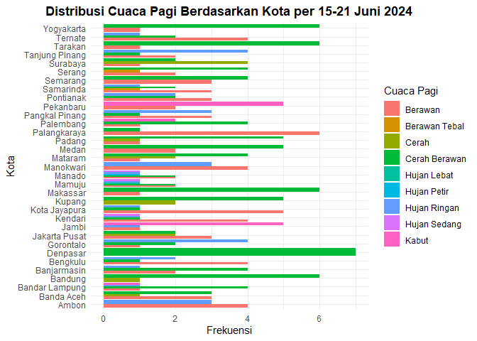

Grafik horizontal bar plot untuk variabel Siang
+ 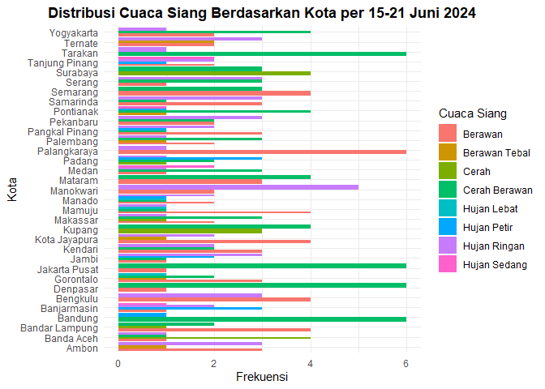

Grafik horizontal bar plot untuk variabel Malam
+ 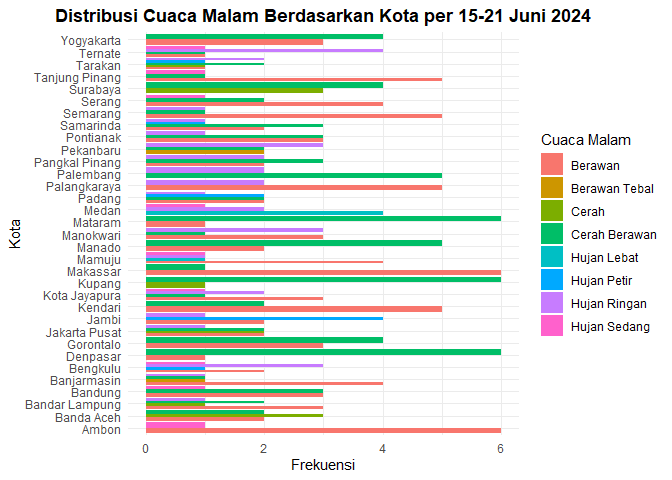

Grafik horizontal bar plot untuk variabel Dini Hari
+ 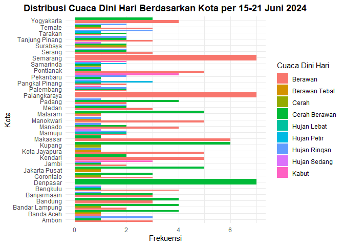

Grafik bar plot untuk Kota berdasarkan variabel Pagi
+ 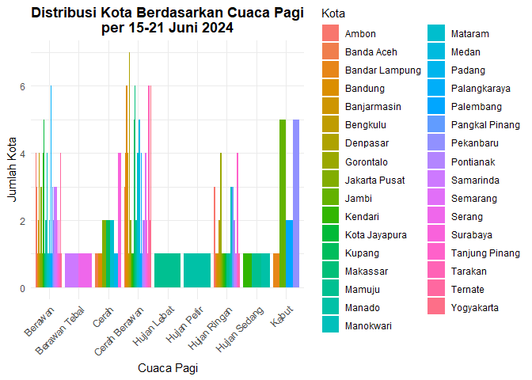

Grafik bar plot untuk Kota berdasarkan variabel Siang
+ 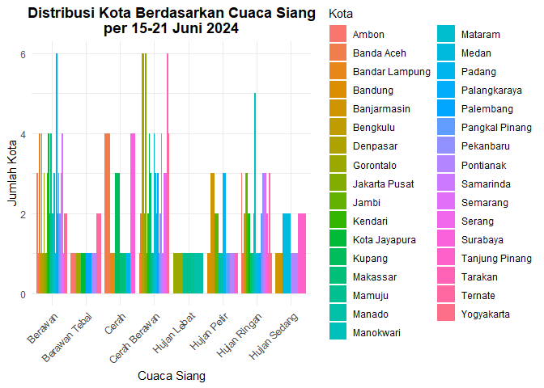

Grafik bar plot untuk Kota berdasarkan variabel Malam
+ 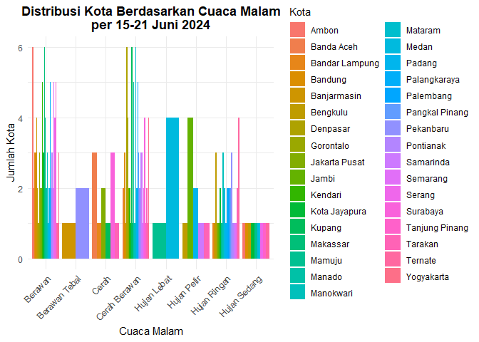

Grafik bar plot untuk Kota berdasarkan variabel Dini Hari
+ 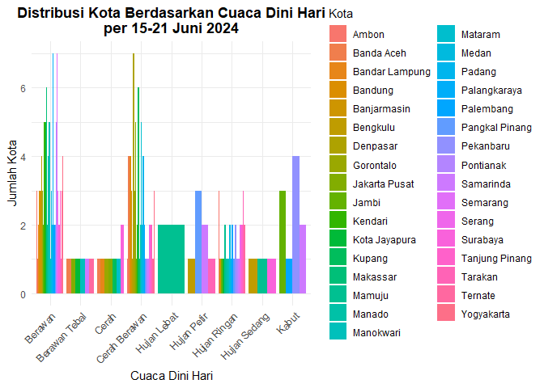

Grafik horizontal bar plot untuk variabel Suhu
+ 

Grafik bar plot untuk Kota berdasarkan rata-rata suhu
+ 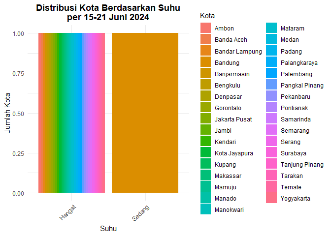

Grafik horizontal bar plot untuk variabel Kelembapan
+ 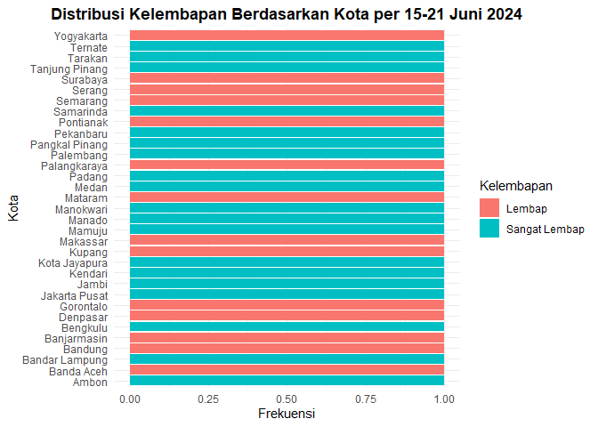

Grafik bar plot untuk Kota berdasarkan rata-rata kelembapan
+ 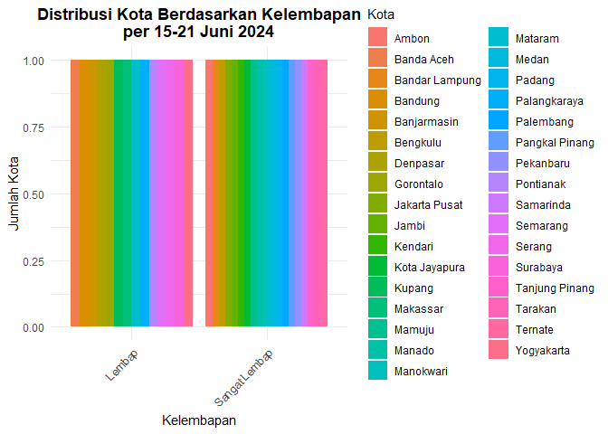

## :books: Visualisasi Data Scraping Jobstreet
Grafik horizontal bar plot untuk variabel Rating
+ 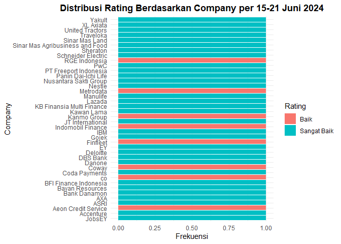

Grafik bar plot untuk Company berdasarkan Rating
+ 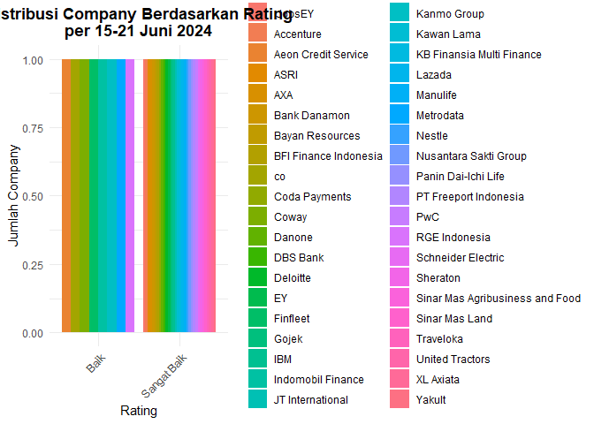

Grafik horizontal bar plot untuk variabel Reviews
+ 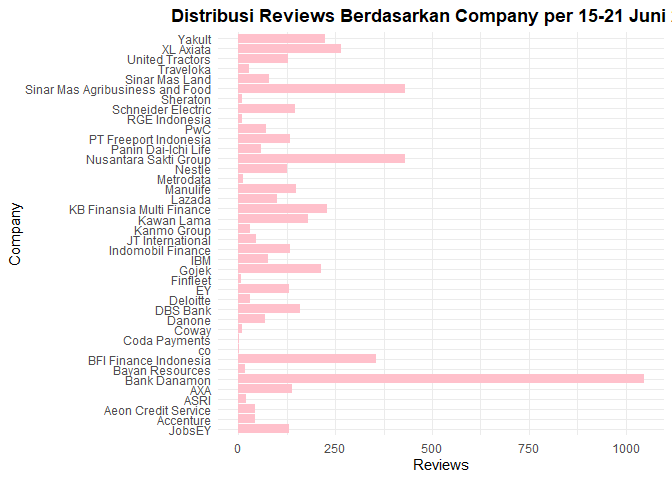

Grafik horizontal bar plot untuk variabel Jobs
+ 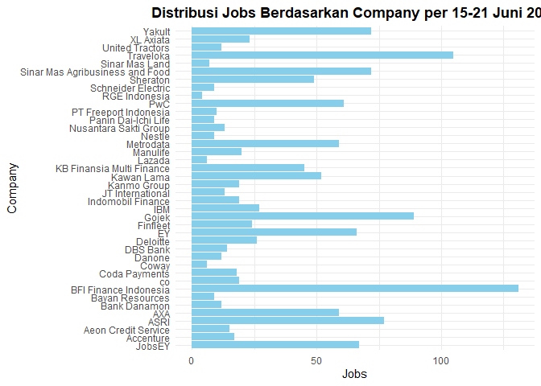
