# PROSES SCRAPING

    library(rvest)

    ## Warning: package 'rvest' was built under R version 4.3.3

    library(httr)

    ## Warning: package 'httr' was built under R version 4.3.3

    library(tidyverse)

    ## Warning: package 'ggplot2' was built under R version 4.3.3

    ## Warning: package 'purrr' was built under R version 4.3.3

    ## ── Attaching core tidyverse packages ───────────────────────────────────────────── tidyverse 2.0.0 ──
    ## ✔ dplyr     1.1.3     ✔ readr     2.1.4
    ## ✔ forcats   1.0.0     ✔ stringr   1.5.0
    ## ✔ ggplot2   3.5.0     ✔ tibble    3.2.1
    ## ✔ lubridate 1.9.2     ✔ tidyr     1.3.0
    ## ✔ purrr     1.0.2     
    ## ── Conflicts ─────────────────────────────────────────────────────────────── tidyverse_conflicts() ──
    ## ✖ dplyr::filter()         masks stats::filter()
    ## ✖ readr::guess_encoding() masks rvest::guess_encoding()
    ## ✖ dplyr::lag()            masks stats::lag()
    ## ℹ Use the conflicted package (<http://conflicted.r-lib.org/>) to force all conflicts to become errors

## BMKG

    url_cuaca <- "https://www.bmkg.go.id/cuaca/prakiraan-cuaca-indonesia.bmkg"
    webpage_1 <- read_html(url_cuaca)

    # Misalkan kita ingin mengekstrak tabel prakiraan cuaca
    tabel_prakiraan <- webpage_1 %>%
      html_nodes("table") %>%
      html_table(fill = TRUE)

    # Convert list ke dataframe
    df_prakiraan_1 <- tabel_prakiraan[[1]]

    # Simpan data ke file CSV
    cuaca_22_06_24 <- df_prakiraan_1
    write.csv(cuaca_22_06_24, "cuaca_22_06_24.csv", row.names = FALSE)

## JOBSTREET

    url_jobstreet <- "https://www.jobstreet.co.id/companies"
    webpage_2 <- read_html(url_jobstreet)

    # Ekstrak judul pekerjaan
    companies <- webpage_2 %>%
      html_nodes("._1cyi0rr5") %>% # Ganti dengan selector CSS yang sesuai
      html_text()

    # Membuat dataframe
    df_jobstreet <- data.frame(
      Companies = companies,
      stringsAsFactors = FALSE
    )

    library(stringr)

    # Definisikan regex untuk mengekstrak informasi perusahaan
    pattern <- "([A-Za-z &-]+\\d(?:\\.\\d)? \\· \\d+ Reviews\\d+ Jobs)"

    # Ekstrak pola yang sesuai
    extracted_info <- str_extract_all(df_jobstreet$Companies, pattern)

    # Bentuk ulang menjadi data frame dengan satu kolom per baris
    df_jobstreet <- data.frame(info = unlist(extracted_info))

    # Pisahkan teks menjadi empat kolom
    df_jobstreet <- df_jobstreet %>%
      mutate(
        Company = str_extract(info, "^[A-Za-z &-]+"), # Ekstrak nama perusahaan
        Rating = str_extract(info, "\\d+(\\.\\d)?"), # Ekstrak rating
        Reviews = str_extract(info, "\\d+ Reviews"), # Ekstrak ulasan
        Jobs = str_extract(info, "\\d+ Jobs") # Ekstrak jumlah pekerjaan
      )

    df_jobstreet <- df_jobstreet %>% select(-info)

    df_jobstreet

    # Simpan data ke file CSV
    write.csv(df_jobstreet, "jobstreet_22_06_24.csv", row.names = FALSE)

# HASIL SCRAPING

## BMKG

    bmkg_15 <- read.csv("cuaca_15_06_24.csv")
    bmkg_16 <- read.csv("cuaca_16_06_24.csv")
    bmkg_17 <- read.csv("cuaca_17_06_24.csv")
    bmkg_18 <- read.csv("cuaca_18_06_24.csv")
    bmkg_19 <- read.csv("cuaca_19_06_24.csv")
    bmkg_20 <- read.csv("cuaca_20_06_24.csv")
    bmkg_21 <- read.csv("cuaca_21_06_24.csv")

    modify_dataframe <- function(df) {
      df <- df[c(3, 2, 1, 4:nrow(df)), ]
      df <- df[-c(1, 2), ]
      rownames(df) <- NULL
      colnames(df) <- c("Kota", "Pagi", "Siang", "Malam", "Dini_Hari", "Suhu", "Kelembapan")
      return(df)
    }
    bmkg <- list(bmkg_15, bmkg_16, bmkg_17, bmkg_18, bmkg_19, bmkg_20, bmkg_21)
    data_bmkg <- lapply(bmkg, modify_dataframe)
    bmkg_15 <- data_bmkg[[1]]
    bmkg_16 <- data_bmkg[[2]]
    bmkg_17 <- data_bmkg[[3]]
    bmkg_18 <- data_bmkg[[4]]
    bmkg_19 <- data_bmkg[[5]]
    bmkg_20 <- data_bmkg[[6]]
    bmkg_21 <- data_bmkg[[7]]

### Menampilkan Data Scraping

    library(dplyr)

    # Menyimpan dataset dalam list
    bmkg <- list(bmkg_15, bmkg_16, bmkg_17, bmkg_18, bmkg_19, bmkg_20, bmkg_21)

    # Membuat urutan tanggal dari 15 Juni 2024 hingga 21 Juni 2024
    dates <- seq(ymd("2024-06-15"), by = "days", length.out = length(bmkg))

    # Menggabungkan semua dataset dalam list menjadi satu dataset besar dan menambahkan kolom tanggal
    data_bmkg <- bind_rows(bmkg, .id = "Tanggal") %>%
      mutate(Tanggal = dates[as.numeric(Tanggal)])

    data_bmkg

### Menampilkan Rata-rata Pagi, Siang, Malam, dan Dini Hari serta Kategori Suhu dan Kelembapan

    # Fungsi untuk mengubah nilai rentang menjadi nilai tengah
    convert_range <- function(x) {
      # Split rentang menjadi nilai terendah dan tertinggi
      range_values <- strsplit(x, " - ")
      min_value <- as.numeric(sapply(range_values, `[`, 1))
      max_value <- as.numeric(sapply(range_values, `[`, 2))
      # Kembalikan nilai tengah
      return((min_value + max_value) / 2)
    }

    # Mengonversi variabel suhu dan kelembapan menjadi nilai numerik tengah
    data_bmkg <- data_bmkg %>%
      mutate(across(c(Suhu, Kelembapan), convert_range))

    stat_mode <- function(x) {
      uniq_x <- unique(x)
      uniq_x[which.max(tabulate(match(x, uniq_x)))]
    }

    # Buat ringkasan berdasarkan kota
    bmkg_by_city <- data_bmkg %>%
      group_by(Kota) %>%
      summarize(mean_pagi = stat_mode(Pagi),
                mean_siang = stat_mode(Siang),
                mean_malam = stat_mode(Malam),
                mean_dini_hari = stat_mode(Dini_Hari),
                mean_suhu = mean(Suhu),
                mean_kelembapan = mean(Kelembapan))

    # Menambahkan kolom kategori suhu
    bmkg_by_city <- bmkg_by_city %>%
      mutate(mean_suhu = case_when(
        as.numeric(mean_suhu) < 10 ~ "Sangat Dingin",
        as.numeric(mean_suhu) >= 10 & as.numeric(mean_suhu) < 15 ~ "Dingin",
        as.numeric(mean_suhu) >= 15 & as.numeric(mean_suhu) < 20 ~ "Sejuk",
        as.numeric(mean_suhu) >= 20 & as.numeric(mean_suhu) < 25 ~ "Sedang",
        as.numeric(mean_suhu) >= 25 & as.numeric(mean_suhu) < 30 ~ "Hangat",
        as.numeric(mean_suhu) >= 30 & as.numeric(mean_suhu) < 35 ~ "Panas",
        as.numeric(mean_suhu) >= 35 ~ "Sangat Panas",
        TRUE ~ "Tidak Diketahui"  # Untuk menangani nilai yang tidak sesuai kategori di atas
      )) %>%
      mutate(mean_kelembapan = case_when(
        as.numeric(mean_kelembapan) < 30 ~ "Sangat Kering",
        as.numeric(mean_kelembapan) >= 30 & as.numeric(mean_kelembapan) < 40 ~ "Kering",
        as.numeric(mean_kelembapan) >= 40 & as.numeric(mean_kelembapan) < 60 ~ "Sedang",
        as.numeric(mean_kelembapan) >= 60 & as.numeric(mean_kelembapan) < 80 ~ "Lembap",
        as.numeric(mean_kelembapan) >= 80 ~ "Sangat Lembap",
        TRUE ~ "Tidak Diketahui"  # Untuk menangani nilai yang tidak sesuai kategori di atas
      ))
    bmkg_by_city

## JOBSTREET

    jobstreet_15 <- read.csv("jobstreet_15_06_24.csv")
    jobstreet_16 <- read.csv("jobstreet_16_06_24.csv")
    jobstreet_17 <- read.csv("jobstreet_17_06_24.csv")
    jobstreet_18 <- read.csv("jobstreet_18_06_24.csv")
    jobstreet_19 <- read.csv("jobstreet_19_06_24.csv")
    jobstreet_20 <- read.csv("jobstreet_20_06_24.csv")
    jobstreet_21 <- read.csv("jobstreet_21_06_24.csv")

    library(dplyr)
    library(stringr)

    remove_df <- function(df)
    {
      df %>%
        mutate(Reviews = str_replace(Reviews, " Reviews", "")) %>%
        mutate(Reviews = as.numeric(Reviews)) %>%
        mutate(Jobs = str_replace(Jobs, " Jobs", "")) %>%
        mutate(Jobs = as.numeric(Jobs))
    }

    # Terapkan fungsi remove_reviews ke masing-masing dataset
    jobstreet_15 <- remove_df(jobstreet_15)
    jobstreet_16 <- remove_df(jobstreet_16)
    jobstreet_17 <- remove_df(jobstreet_17)
    jobstreet_18 <- remove_df(jobstreet_18)
    jobstreet_19 <- remove_df(jobstreet_19)
    jobstreet_20 <- remove_df(jobstreet_20)
    jobstreet_21 <- remove_df(jobstreet_21)

### Menampilkan Data Scraping

    library(dplyr)

    # Menyimpan dataset dalam list
    jobstreet <- list(jobstreet_15, jobstreet_16, jobstreet_17, jobstreet_18, jobstreet_19, jobstreet_20, 
                 jobstreet_21)

    # Membuat urutan tanggal dari 15 Juni 2024 hingga 21 Juni 2024
    dates <- seq(ymd("2024-06-15"), by = "days", length.out = length(jobstreet))

    # Menggabungkan semua dataset dalam list menjadi satu dataset besar dan menambahkan kolom tanggal
    data_jobstreet <- bind_rows(jobstreet, .id = "Tanggal") %>%
      mutate(Tanggal = dates[as.numeric(Tanggal)])

    data_jobstreet

### Menampilkan Kategori Rating

    data_jobstreet <- data_jobstreet %>%
      arrange(Company, desc(Tanggal)) %>%
      distinct(Company, .keep_all = TRUE) %>%
      distinct(Rating, Reviews, Jobs, .keep_all = TRUE) %>%
      mutate(Rating = case_when(
        as.numeric(Rating) <= 1 ~ "Sangat Buruk",
        as.numeric(Rating) > 1 & as.numeric(Rating) <= 2 ~ "Buruk",
        as.numeric(Rating) > 2 & as.numeric(Rating) <= 3 ~ "Cukup",
        as.numeric(Rating) > 3 & as.numeric(Rating) <= 4 ~ "Baik",
        as.numeric(Rating) > 4 & as.numeric(Rating) <= 5 ~ "Sangat Baik",
        TRUE ~ "Tidak Diketahui"  # Untuk menangani nilai yang tidak sesuai kategori di atas
      ))

    data_jobstreet

# VISUALISASI DATA SCRAPING

## BMKG

    library(ggplot2)

    # Buat grafik horizontal bar plot untuk variabel Pagi
    ggplot(data_bmkg, aes(x = Kota, fill = Pagi)) +
      geom_bar(position = "dodge") +
      coord_flip() +
      labs(title = "Distribusi Cuaca Pagi Berdasarkan Kota per 15-21 Juni 2024",
           x = "Kota",
           y = "Frekuensi",
           fill = "Cuaca Pagi") +
      theme_minimal()+
      theme(plot.title = element_text(hjust = 0.5, face = "bold"))

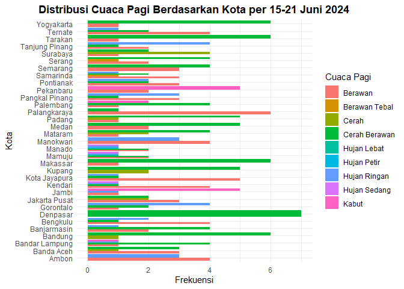

    # Buat grafik horizontal bar plot untuk variabel Siang
    ggplot(data_bmkg, aes(x = Kota, fill = Siang)) +
      geom_bar(position = "dodge") +
      coord_flip() +
      labs(title = "Distribusi Cuaca Siang Berdasarkan Kota per 15-21 Juni 2024",
           x = "Kota",
           y = "Frekuensi",
           fill = "Cuaca Siang") +
      theme_minimal()+
      theme(plot.title = element_text(hjust = 0.5, face = "bold"))

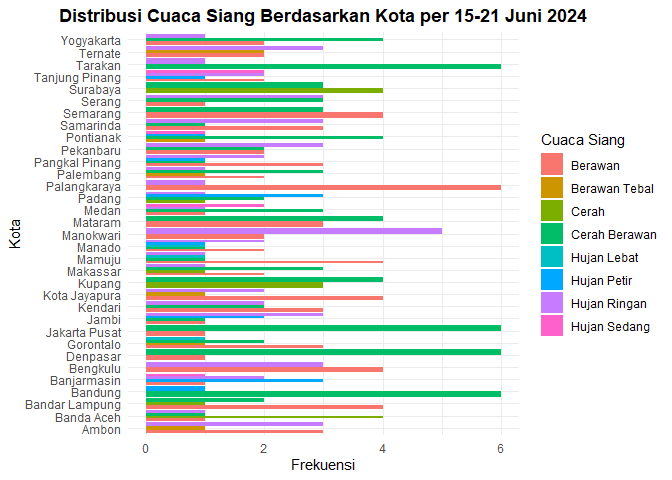

    # Buat grafik horizontal bar plot untuk variabel Malam
    ggplot(data_bmkg, aes(x = Kota, fill = Malam)) +
      geom_bar(position = "dodge") +
      coord_flip() +
      labs(title = "Distribusi Cuaca Malam Berdasarkan Kota per 15-21 Juni 2024",
           x = "Kota",
           y = "Frekuensi",
           fill = "Cuaca Malam") +
      theme_minimal()+
      theme(plot.title = element_text(hjust = 0.5, face = "bold"))

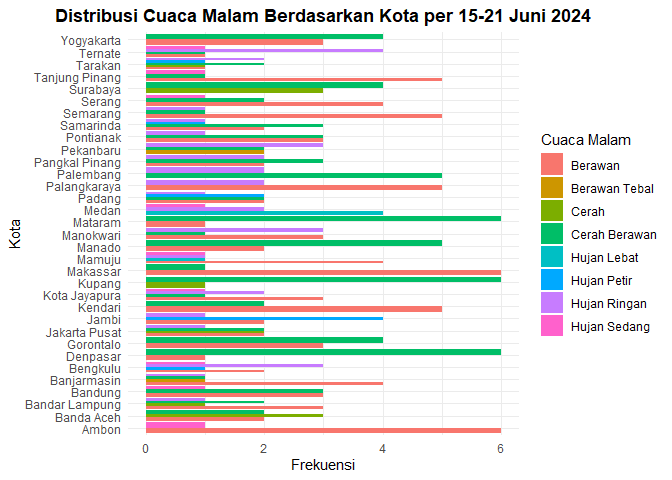

    # Buat grafik horizontal bar plot untuk variabel Dini Hari
    ggplot(data_bmkg, aes(x = Kota, fill = Dini_Hari)) +
      geom_bar(position = "dodge") +
      coord_flip() +
      labs(title = "Distribusi Cuaca Dini Hari Berdasarkan Kota per 15-21 Juni 2024",
           x = "Kota",
           y = "Frekuensi",
           fill = "Cuaca Dini Hari") +
      theme_minimal()+
      theme(plot.title = element_text(hjust = 0.5, face = "bold"))

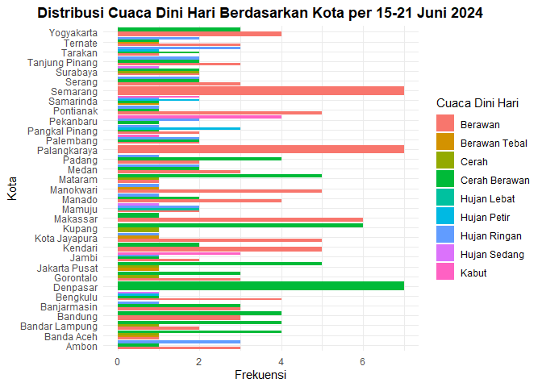

    # Buat grafik bar plot untuk Kota berdasarkan variabel Pagi
    ggplot(data_bmkg, aes(x = Pagi, fill = Kota)) +
      geom_bar(position = "dodge") +
      labs(title = "Distribusi Kota Berdasarkan Cuaca Pagi\nper 15-21 Juni 2024",
           x = "Cuaca Pagi",
           y = "Jumlah Kota",
           fill = "Kota") +
      theme_minimal() +
      theme(plot.title = element_text(hjust = 0.5, face = "bold"),
            axis.text.x = element_text(angle = 45, hjust = 1))

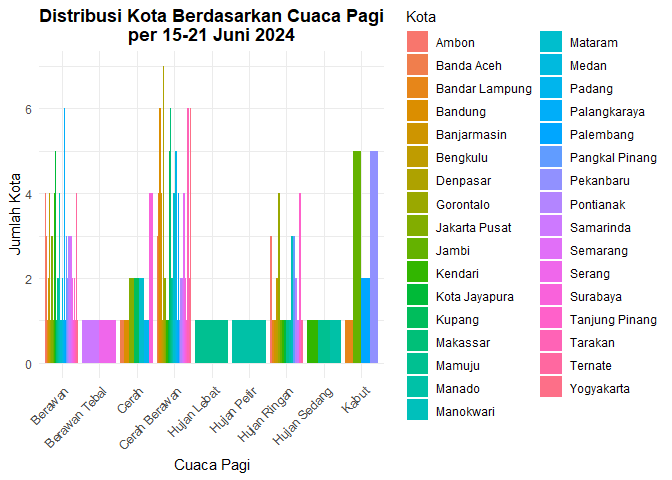

    # Buat grafik bar plot untuk Kota berdasarkan variabel Siang
    ggplot(data_bmkg, aes(x = Siang, fill = Kota)) +
      geom_bar(position = "dodge") +
      labs(title = "Distribusi Kota Berdasarkan Cuaca Siang\nper 15-21 Juni 2024",
           x = "Cuaca Siang",
           y = "Jumlah Kota",
           fill = "Kota") +
      theme_minimal() +
      theme(plot.title = element_text(hjust = 0.5, face = "bold"),
            axis.text.x = element_text(angle = 45, hjust = 1))

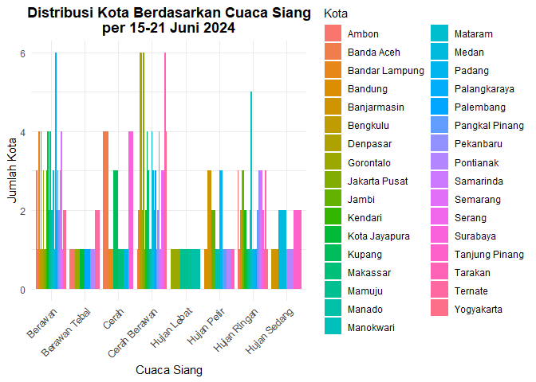

    # Buat grafik bar plot untuk Kota berdasarkan variabel Malam
    ggplot(data_bmkg, aes(x = Malam, fill = Kota)) +
      geom_bar(position = "dodge") +
      labs(title = "Distribusi Kota Berdasarkan Cuaca Malam\nper 15-21 Juni 2024",
           x = "Cuaca Malam",
           y = "Jumlah Kota",
           fill = "Kota") +
      theme_minimal() +
      theme(plot.title = element_text(hjust = 0.5, face = "bold"),
            axis.text.x = element_text(angle = 45, hjust = 1))

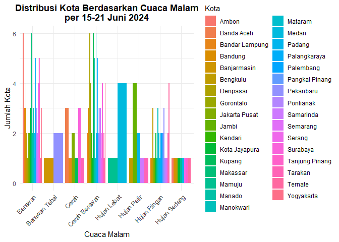

    # Buat grafik bar plot untuk Kota berdasarkan variabel Dini Hari
    ggplot(data_bmkg, aes(x = Dini_Hari, fill = Kota)) +
      geom_bar(position = "dodge") +
      labs(title = "Distribusi Kota Berdasarkan Cuaca Dini Hari\nper 15-21 Juni 2024",
           x = "Cuaca Dini Hari",
           y = "Jumlah Kota",
           fill = "Kota") +
      theme_minimal() +
      theme(plot.title = element_text(hjust = 0.5, face = "bold"),
            axis.text.x = element_text(angle = 45, hjust = 1))

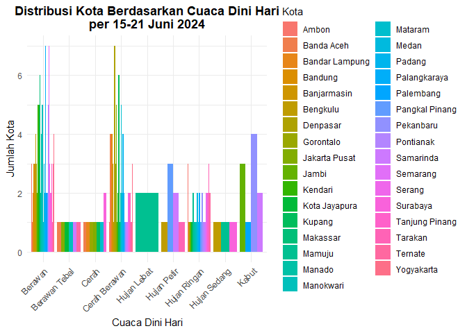

    # Buat grafik horizontal bar plot untuk variabel Suhu
    ggplot(bmkg_by_city, aes(x = Kota, fill = mean_suhu)) +
      geom_bar(position = "dodge") +
      coord_flip() +
      labs(title = "Distribusi Suhu Berdasarkan Kota per 15-21 Juni 2024",
           x = "Kota",
           y = "Frekuensi",
           fill = "Suhu") +
      theme_minimal()+
      theme(plot.title = element_text(hjust = 0.5, face = "bold"))

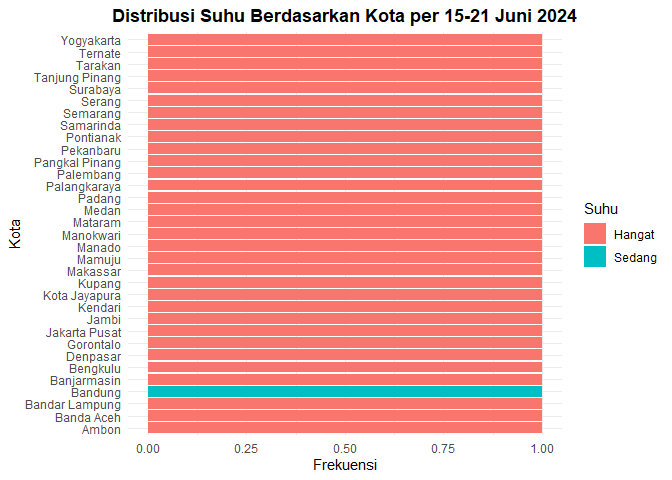

    # Buat grafik bar plot untuk Kota berdasarkan rata-rata suhu
    ggplot(bmkg_by_city, aes(x = mean_suhu, fill = Kota)) +
      geom_bar(position = "dodge") +
      labs(title = "Distribusi Kota Berdasarkan Suhu\nper 15-21 Juni 2024",
           x = "Suhu",
           y = "Jumlah Kota",
           fill = "Kota") +
      theme_minimal() +
      theme(plot.title = element_text(hjust = 0.5, face = "bold"),
            axis.text.x = element_text(angle = 45, hjust = 1))

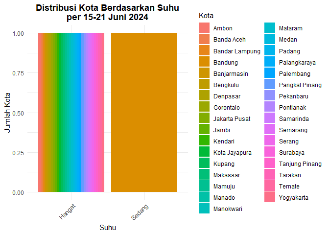

    # Buat grafik horizontal bar plot untuk variabel Kelembapan
    ggplot(bmkg_by_city, aes(x = Kota, fill = mean_kelembapan)) +
      geom_bar(position = "dodge") +
      coord_flip() +
      labs(title = "Distribusi Kelembapan Berdasarkan Kota per 15-21 Juni 2024",
           x = "Kota",
           y = "Frekuensi",
           fill = "Kelembapan") +
      theme_minimal()+
      theme(plot.title = element_text(hjust = 0.5, face = "bold"))

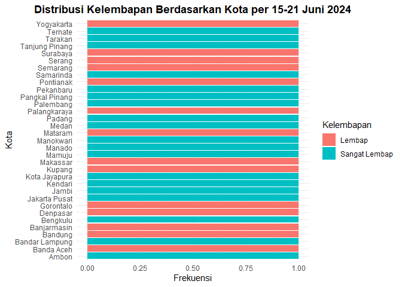

    # Buat grafik bar plot untuk Kota berdasarkan rata-rata kelembapan
    ggplot(bmkg_by_city, aes(x = mean_kelembapan, fill = Kota)) +
      geom_bar(position = "dodge") +
      labs(title = "Distribusi Kota Berdasarkan Kelembapan\nper 15-21 Juni 2024",
           x = "Kelembapan",
           y = "Jumlah Kota",
           fill = "Kota") +
      theme_minimal() +
      theme(plot.title = element_text(hjust = 0.5, face = "bold"),
            axis.text.x = element_text(angle = 45, hjust = 1))

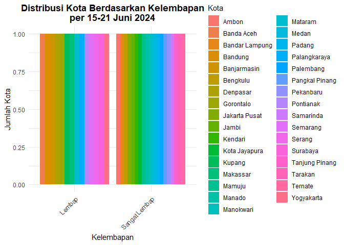

## JOBSTREET

    library(ggplot2)

    # Buat grafik horizontal bar plot untuk variabel Rating
    ggplot(data_jobstreet, aes(x = Company, fill = Rating)) +
      geom_bar(position = "dodge") +
      coord_flip() +
      labs(title = "Distribusi Rating Berdasarkan Company per 15-21 Juni 2024",
           x = "Company",
           y = "Frekuensi",
           fill = "Rating") +
      theme_minimal()+
      theme(plot.title = element_text(hjust = 0.5, face = "bold"))

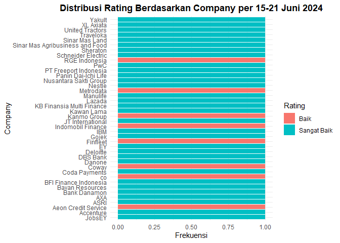

    # Buat grafik bar plot untuk Company berdasarkan Rating
    ggplot(data_jobstreet, aes(x = Rating, fill = Company)) +
      geom_bar(position = "dodge") +
      labs(title = "Distribusi Company Berdasarkan Rating\nper 15-21 Juni 2024",
           x = "Rating",
           y = "Jumlah Company",
           fill = "Company") +
      theme_minimal() +
      theme(plot.title = element_text(hjust = 0.5, face = "bold"),
            axis.text.x = element_text(angle = 45, hjust = 1))

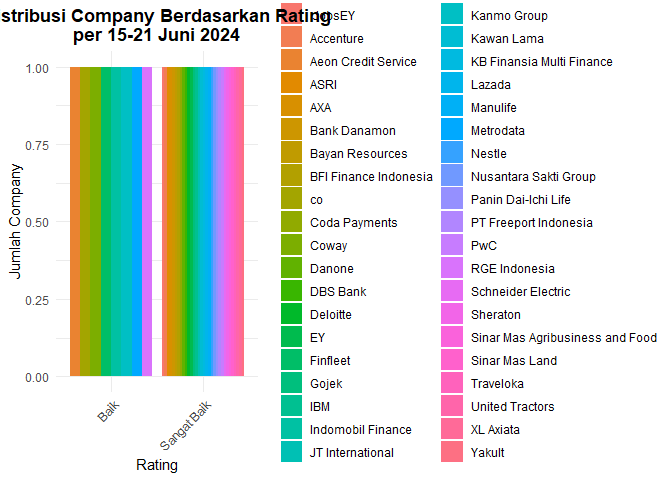

    library(ggplot2)

    # Buat grafik horizontal bar plot untuk variabel Reviews
    ggplot(data_jobstreet, aes(x = Company, y = Reviews)) +
      geom_bar(stat = "identity", fill = "pink")+
      coord_flip() +
      labs(title = "Distribusi Reviews Berdasarkan Company per 15-21 Juni 2024",
           x = "Company",
           y = "Reviews") +
      theme_minimal()+
      theme(plot.title = element_text(hjust = 0.5, face = "bold"))

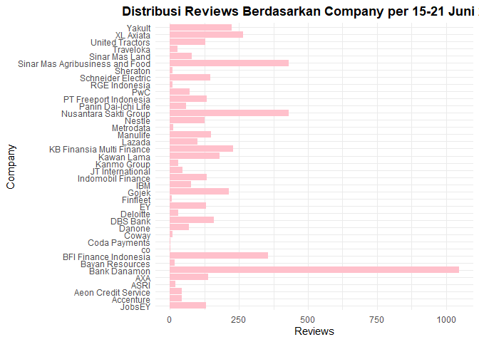

    library(ggplot2)

    # Buat grafik horizontal bar plot untuk variabel Jobs
    ggplot(data_jobstreet, aes(x = Company, y = Jobs)) +
      geom_bar(stat = "identity", fill = "skyblue")+
      coord_flip() +
      labs(title = "Distribusi Jobs Berdasarkan Company per 15-21 Juni 2024",
           x = "Company",
           y = "Jobs") +
      theme_minimal()+
      theme(plot.title = element_text(hjust = 0.5, face = "bold"))

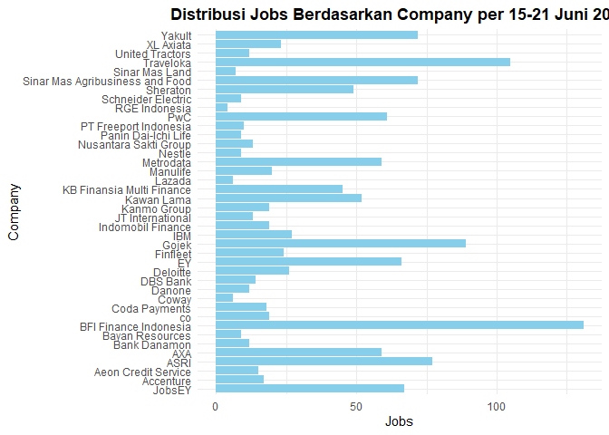
# scraping_data
